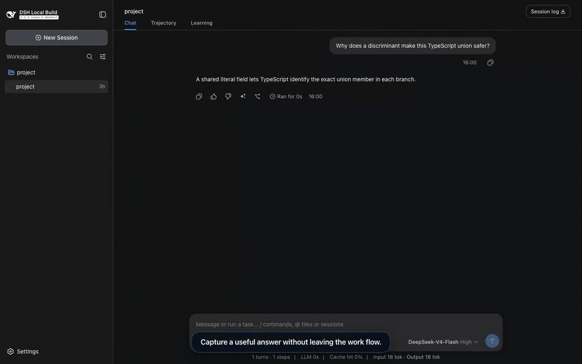

<div align="right">
  <strong>English</strong> · <a href="README.zh-CN.md">简体中文</a>
</div>

<p align="center">
  
</p>

<p align="center">
  
  <a href="https://github.com/yuezengwu/dsh-explain/actions/workflows/ci.yml"></a>
  <a href="https://github.com/yuezengwu/dsh-explain/releases/latest"></a>
  
  <a href="LICENSE"></a>
</p>

<p align="center">
  <a href="#quick-start">Quick start</a> ·
  <a href="docs/assets/dsh-explain-demo.mp4">Watch the full demo</a> ·
  <a href="#local-first-by-design">Privacy model</a> ·
  <a href="docs/DEMO.md">Reproduce the recording</a>
</p>

`dsh-explain` is a learning-mode plugin for [DeepSeek Harness](https://github.com/deepseek-ai/deepseek-harness). It turns useful concepts from completed work into structured explanations, schedules lightweight reviews, and lets you inspect or correct what it learns about you.

The primary agent stays untouched. Explain uses its own model calls, scheduler, context, and local SQLite database.

## See the learning loop



The 28-second preview runs against real assembled DSH Web `0.1.2-rc.1` with deterministic, private fixture data. [Watch the higher-quality MP4](docs/assets/dsh-explain-demo.mp4) or read the [recording contract](docs/DEMO.md).

| Capture | Review | Adapt |
|---|---|---|
| Turn a finalized answer or selected text into an editable `/explain` draft. Nothing submits automatically. | Revisit due concepts through recall, application, and distinction questions. | Inspect explanation preferences and topic familiarity, then correct or forget an inference. |

## Quick start

The current development and installation baseline is DSH `0.1.5-rc.2`, available on npm as of 2026-09-11. npm `next` points to this version, `latest` to `0.1.5-rc.1`, and `alpha` to `0.1.5-alpha.2`. Both new release candidates and all five previously verified hosts remain supported. Pin the version explicitly; see the [compatibility contract](docs/COMPATIBILITY.md) for exact source revisions and verification.

```sh
npx @deepseek-ai/dsh@0.1.5-rc.2 plugin --profile web add github:yuezengwu/dsh-explain
npx @deepseek-ai/dsh@0.1.5-rc.2 --profile web
```

Open **Settings → Learning**, choose an auxiliary provider and model, enable learning mode, and save. Explain observes only future completed top-level turns; it does not scan existing history.

Git-hosted plugins build during installation. If pnpm requests build approval, add the printed `dsh-explain` entry to the profile's `pnpm-workspace.yaml`, then repeat the install command. For automated runs that should not open a browser, start DSH with `--no-open`.

> The latest tagged Explain release is `v0.2.0`; `v0.3.0` has not been published. Installing from GitHub uses the current `main` branch with compatibility for all seven versions listed below.

## Start from the work itself

| Entry point | What happens |
|---|---|
| `/explain <request>` | Requests an explanation using the current session as bounded source context. |
| **Explain selected text** | Creates an editable `/explain --selection …` draft from visible text. |
| **Learn from this answer** | Creates an editable draft tied to the exact finalized assistant turn. |
| Automatic evaluation | May add one useful explanation after an eligible turn, within your configured budget. |
| `/review` | Opens or resumes a local review round in the Learning tab. |

Each explanation answers three practical questions: **What is it? Why does it matter here? What is the common pitfall?** Choose **Got it** to close the card, or **Not yet** for a different explanation.

## Review, then correct the model

Concepts marked **Got it** enter a local spaced-review schedule. **Learning → Today's review** selects up to three due concepts. Each concept advances from recall to application to distinction after successful answers; an unsuccessful answer repeats that skill next time. The auxiliary model evaluates each answer as **Mastered**, **Partial**, or **Forgotten** and schedules the next review at a deterministic interval. Partial or forgotten concepts are treated as learning again and can receive a new explanation; an active explanation pauses that concept's quiz.

**Learning → Learning overview** exposes the current judgments about explanation length, structure, examples, terminology, and topic familiarity—with confidence and source links. You can correct an inference, forget it, or set an explicit preference. Precedence is fixed and visible: **explicit preference → user correction → model inference**.

## One learning thread, many sessions

- Every `$DSH_HOME` owns exactly one Explain learning thread; resumes and forks never copy it.
- Every source session has at most one explanation awaiting feedback.
- One global scheduler serializes explanations, reviews, autonomous evaluation, rephrases, and compaction.
- Autonomous evaluation has a persistent rolling 24-hour budget, configurable in Settings.
- Rephrasing still works if a source session is later deleted because only a bounded source summary is retained.

## Local-first by design

| Data | Behavior |
|---|---|
| Learning thread | Stored in `$DSH_HOME/dsh-explain/v1/thread.sqlite`. |
| Enablement and model settings | Stored through DSH settings in `$DSH_HOME/settings.yaml`. |
| Source material | Reduced to bounded capsules; rephrasing retains at most a 2,000-character restricted summary. |
| Global learning context | Sent with bounded source text to the configured auxiliary provider. Local storage does not imply offline model inference. |
| Export | A versioned local backup excludes private source summaries and filters common credential/path formats in public text. Arbitrary private prose may remain; review before sharing. |
| Clear | A typed `CLEAR` confirmation atomically removes learned content while preserving runtime settings and the active budget window. |

Explain uses first-party DSH conversation, composer, assistant-action, and settings extension points. It does not require patches to DSH or other plugins.

## Compatibility and verification

| Check | Current result |
|---|---|
| DSH compatibility | `0.1.5-rc.2` published packages; `0.1.2-rc.1`, `0.1.3-alpha.1`, `0.1.3-alpha.2`, `0.1.5-alpha.1`, `0.1.5-alpha.2`, `0.1.5-rc.1`, and `0.1.5-rc.2` assembled source |
| Unit and integration | 80 tests on each source version |
| Assembled DSH Web | 7 scenarios per source version |
| Explain-owned shortcuts | 3 M6 scenarios |
| Production package | Build and pack dry-run |

See the [acceptance matrix](docs/ACCEPTANCE.md) for coverage and [PR #16](https://github.com/yuezengwu/dsh-explain/pull/16) for the earlier real-model workflow evidence. DSH remains a developer preview; Explain follows its current public API line instead of retaining compatibility layers for private-preview packages.

## Local development

The default development install uses published `0.1.5-rc.2` API packages, with a version-scoped repair for their [missing store runtime dependencies](docs/COMPATIBILITY.md#发布包依赖修复). Assembled-Web tests accept a built DSH `0.1.2-rc.1`, `0.1.3-alpha.1`, `0.1.3-alpha.2`, `0.1.5-alpha.1`, `0.1.5-alpha.2`, `0.1.5-rc.1`, or `0.1.5-rc.2` checkout. The existing demo recording remains on `0.1.2-rc.1`:

```sh
pnpm install
DSH_SOURCE_DIR=/absolute/path/to/dsh pnpm dsh:link
DSH_SOURCE_DIR=/absolute/path/to/dsh pnpm dsh:link:check
pnpm typecheck
pnpm test
DSH_SOURCE_DIR=/absolute/path/to/dsh pnpm test:web
DSH_SOURCE_DIR=/absolute/path/to/dsh pnpm test:m6
pnpm build
```

Install this checkout directly for manual development:

```sh
dsh plugin --profile web add /absolute/path/to/dsh-explain
dsh --profile web --dump-config
dsh --profile web
```

## Documentation

| Document | Purpose |
|---|---|
| [Demo production](docs/DEMO.md) | Storyboard, privacy contract, commands, assets, and artwork provenance. |
| [Product requirements](docs/PRD.md) | User model, scope, policies, and acceptance criteria. |
| [Architecture](docs/ARCHITECTURE.md) | Persistence, scheduling, RPC, UI integration, and failure behavior. |
| [Acceptance matrix](docs/ACCEPTANCE.md) | Automated and real-flow evidence. |
| [Iteration plan](docs/NEXT.md) | Completed milestones and follow-up sequencing. |

## License

[MIT](LICENSE)
