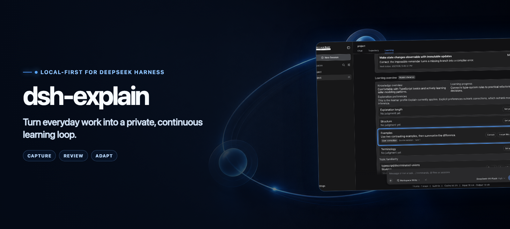

<div align="right">
  <a href="README.md">English</a> · <strong>简体中文</strong>
</div>

<p align="center">
  
</p>

<p align="center">
  
  <a href="https://github.com/yuezengwu/dsh-explain/actions/workflows/ci.yml"></a>
  <a href="https://github.com/yuezengwu/dsh-explain/releases/latest"></a>
  
  <a href="LICENSE"></a>
</p>

<p align="center">
  <a href="#快速开始">快速开始</a> ·
  <a href="docs/assets/dsh-explain-demo.mp4">观看完整 Demo</a> ·
  <a href="#本地优先">隐私模型</a> ·
  <a href="docs/DEMO.md">复现录制</a>
</p>

`dsh-explain` 是 [DeepSeek Harness](https://github.com/deepseek-ai/deepseek-harness) 的学习模式插件。它把已完成工作中的有用概念整理成结构化讲解，安排轻量复习，并让你查看、修正它对你的认识。

主 Agent 保持不变。Explain 使用独立的模型调用、调度器、学习上下文和本地 SQLite 数据库。

## 看见完整学习闭环


这段 28 秒预览运行在真实组装的 DSH Web `0.1.2-rc.1` 上，使用确定性、无隐私数据的样例环境。可以[观看高清 MP4](https://raw.githubusercontent.com/yuezengwu/dsh-explain/main/docs/assets/dsh-explain-demo.mp4)，或阅读[录制约束](https://github.com/yuezengwu/dsh-explain/blob/main/docs/DEMO.md)。

| 捕获 Capture | 复习 Review | 校正 Adapt |
|---|---|---|
| 把已完成回答或选中文字变成可编辑的 `/explain` 草稿，绝不自动提交。 | 通过回忆、应用、辨析三类问题复习到期概念。 | 查看讲解偏好与 Topic 熟悉度，并修正或忘记一次推断。 |

## 快速开始

`main` 已适配 DSH `0.1.7-rc.1`，保留十二个既有宿主，尚未发布新的 Explain 标签。最新发布版仍为 `v0.3.1`，支持范围截至 DSH `0.1.6-alpha.2`。精确源码提交与证据见[兼容约定](https://github.com/yuezengwu/dsh-explain/blob/main/docs/COMPATIBILITY.md)。

使用新 alpha 时，安装当前开发分支：

```sh
npx @deepseek-ai/dsh@0.1.7-rc.1 plugin --profile web add github:yuezengwu/dsh-explain#main
npx @deepseek-ai/dsh@0.1.7-rc.1 --profile web
```

使用已发布标签时，继续搭配 DSH `0.1.6-alpha.2` 和 `github:yuezengwu/dsh-explain#v0.3.1`。2026-09-24 核对：npm `next` 为 `0.1.7-rc.1`，`latest` 为 `0.1.5-rc.3`，`alpha` 为 `0.1.7-alpha.2`。安装默认渠道宿主时，把上述两条命令中的版本均改为 `0.1.5-rc.3`。

启动后进入「**设置 → 学习**」，选择辅助模型的 provider 和 model，启用学习模式并保存。Explain 只观察此后完成的顶层工作回合，不补扫已有历史。

Git 仓库插件会在安装时构建。如果 pnpm 要求批准构建，请按提示把 `dsh-explain` 加入该 profile 的 `pnpm-workspace.yaml`，然后重新执行安装命令。自动化运行不应打开浏览器时，可在启动 DSH 时加上 `--no-open`。

> [v0.3.1](https://github.com/yuezengwu/dsh-explain/releases/tag/v0.3.1) 新增 DSH 0.1.6-alpha.2 支持，保留八个已验证的旧宿主。修复新版 Session API 下的来源跳转和 Explain 快捷入口，并覆盖插件实时停用/启用。既有学习数据继续兼容（SQLite schema 4、backup v3）。

## 从正在做的工作开始学习

| 入口 | 行为 |
|---|---|
| `/explain <学习请求>` | 使用当前会话的受限来源上下文主动请求一次讲解。 |
| **解释选中文字** | 从可见选区创建可编辑的 `/explain --selection …` 草稿。 |
| **学习这个回答** | 创建绑定到精确 assistant 完成回合的可编辑草稿。 |
| 自主判断 | 合格工作回合结束后，在配置额度内生成一条值得学习的讲解。 |
| `/review` | 在「学习」Tab 开始或继续一轮本地复习。 |

每张学习卡回答三个实际问题：**是什么？为什么在这里重要？常见坑是什么？** 选择「**懂了**」关闭卡片，或选择「**没懂**」换一种讲法。

## 复习，然后校正模型

标记「**懂了**」的概念会进入本地间隔复习计划。「**学习 → 今日复习**」每轮选择最多三个到期概念；每个概念独立从回忆推进到应用、辨析，答对后进阶，答错后继续练习当前题型。辅助模型把答案评为「**掌握 / 模糊 / 遗忘**」，再按确定性间隔安排下次复习。模糊或遗忘的概念重新视为学习中，允许补充讲解；该概念存在活跃讲解时暂不安排测验。

「**学习 → 学习概况**」公开显示讲解长度、结构、示例、术语和 Topic 熟悉度判断，并附带信心与来源回链。你可以修正推断、忘记判断或设置显式偏好。优先级固定且可见：**显式偏好 → 用户修正 → 模型推断**。

## 多个工作会话，一条学习线程

- 每个 `$DSH_HOME` 只有一条 Explain 学习线程；resume 和 fork 不会复制它。
- 每个来源会话至多有一条等待反馈的讲解。
- 一个全局调度器串行处理讲解、复习、自主判断、重讲和压缩。
- 自主判断使用持久化的滚动 24 小时额度，可在设置中调整。
- 即使来源会话之后被删除，基于有界来源摘要的重讲仍然可用。

## 本地优先

| 数据 | 行为 |
|---|---|
| 学习线程 | 持久化到 `$DSH_HOME/dsh-explain/v1/thread.sqlite`。 |
| 开关与模型设置 | DSH 0.1.7 保存到当前 profile patch，旧宿主仍使用 `$DSH_HOME/settings.yaml`。首次迁移只导入 Explain 自己的字段，保留新版显式设置与原文件，不迁移存储路径。 |
| 来源材料 | 只保留有界 capsule；重讲最多持久化 2,000 字符的受限摘要。 |
| 全局学习上下文 | 与有界来源文本一起发送给所选辅助 provider；本地存储不等于离线推理，不进入主 Agent。 |
| 导出 | 版本化备份排除私有来源摘要，并过滤公开文本中常见的凭证和路径格式；自由文本仍可能包含隐私，分享前需检查。 |
| 清除 | 输入 `CLEAR` 后原子删除学习内容，同时保留运行设置和当前额度窗口。 |

Explain 只使用 DSH 第一方 conversation、composer、assistant action 和 settings 扩展点，不要求修改 DSH 或其他插件。

## 兼容性与验证

| 检查 | 当前结果 |
|---|---|
| DSH 兼容 | `0.1.7-rc.1` 发布包；`0.1.2-rc.1`、`0.1.3-alpha.1`、`0.1.3-alpha.2`、`0.1.5-alpha.1`、`0.1.5-alpha.2`、`0.1.5-rc.1`、`0.1.5-rc.2`、`0.1.5-rc.3`、`0.1.6-alpha.1`、`0.1.6-alpha.2`、`0.1.7-alpha.1`、`0.1.7-alpha.2`、`0.1.7-rc.1` 组装源码 |
| 单元与集成 | 十三个源码版本各 90 项测试 |
| DSH Web 组装验收 | 7 个共有场景；0.1.7 增加旧设置迁移与重启恢复 |
| Explain 自有快捷入口 | 3 个 M6 场景；0.1.6-alpha.2 与两个 0.1.7 alpha 与 rc.1 增加实时停用与重新启用验收 |
| 生产包 | frozen install、构建与实际 pack |
| 真实辅助模型 | DSH `0.1.6-alpha.1` + `deepseek-flash`：讲解、重讲、偏好修正、正反答案复习、精确回答命令、导出与清空 |

完整覆盖见[验收矩阵](https://github.com/yuezengwu/dsh-explain/blob/main/docs/ACCEPTANCE.md)，当前模型路由、样例、截图与验收范围见 [2026-09-15 真实模型验收](https://github.com/yuezengwu/dsh-explain/blob/main/docs/REAL_MODEL_ACCEPTANCE.md)。DSH 仍处于开发者预览阶段；Explain 跟随当前公开 API 版本线，不保留更早私有预览包的兼容层。

## 本地开发

默认开发安装使用已发布的 `0.1.7-rc.1` API 包，并仅针对已复现版本补齐[遗漏的 store 运行依赖](https://github.com/yuezengwu/dsh-explain/blob/main/docs/COMPATIBILITY.md#发布包依赖修复)。组装 Web 测试支持上表十三个版本中任一已构建的 DSH 源码 checkout；现有 Demo 录制仍使用 `0.1.2-rc.1`：

```sh
pnpm install
DSH_SOURCE_DIR=/absolute/path/to/dsh pnpm dsh:link
DSH_SOURCE_DIR=/absolute/path/to/dsh pnpm dsh:link:check
pnpm typecheck
pnpm test
DSH_SOURCE_DIR=/absolute/path/to/dsh pnpm test:web
DSH_SOURCE_DIR=/absolute/path/to/dsh pnpm test:m6
pnpm build
```

手工开发时直接安装当前 checkout：

```sh
dsh plugin --profile web add /absolute/path/to/dsh-explain
dsh --profile web --dump-config
dsh --profile web
```

## 文档

| 文档 | 内容 |
|---|---|
| [Demo 制作](https://github.com/yuezengwu/dsh-explain/blob/main/docs/DEMO.md) | 分镜、隐私约束、复现命令、素材与绘图来源。 |
| [产品需求](https://github.com/yuezengwu/dsh-explain/blob/main/docs/PRD.md) | 用户模型、范围、策略和验收标准。 |
| [技术架构](https://github.com/yuezengwu/dsh-explain/blob/main/docs/ARCHITECTURE.md) | 持久化、调度、RPC、UI 集成和失败行为。 |
| [验收矩阵](https://github.com/yuezengwu/dsh-explain/blob/main/docs/ACCEPTANCE.md) | 自动化与真实流程证据。 |
| [迭代计划](https://github.com/yuezengwu/dsh-explain/blob/main/docs/NEXT.md) | 已完成里程碑与后续顺序。 |

## 许可证

[MIT](LICENSE)
