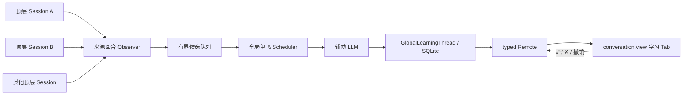
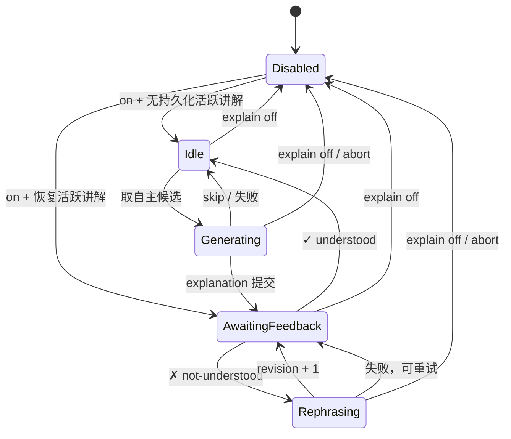

# dsh-explain 技术架构 v5（待 Review）

> 状态：**v5 提交待 review**（2026-08-12）。产品需求见 [PRD.md](./PRD.md)。
> v5 以“每个 `$DSH_HOME` 一条全局学习线程”为核心，取代 v4 的每 Session explain 事件、projection、行内卡片和 turnTail 方案。

## 架构结论

`dsh-explain` 是一个用户全局、串行推进的辅助学习运行时，不是第二个 DSH AgentLoop。

- 多个顶层工作 Session 只提供候选素材。
- 全局 Scheduler 一次只运行一个辅助模型请求。
- 全局学习线程一次只允许一个 Topic 等待反馈。
- 学习事实存入插件自有 SQLite，不进入主 Session 日志。
- 主模型不可见：不 append 自定义 Session 事件、不 inject、不 steer、不改变 `deriveMessages()`。
- P0 的唯一交互界面是 DSH 第一方 `conversation.view` 中的「学习」Tab；每个 Session 有独立入口和选中状态，所有入口读取同一份全局数据。



## 作用域

“用户全局”在 P0 中严格指一个 `$DSH_HOME`：

- 数据跨来源 Session、profile、页面刷新和正常进程重启保留。
- fork 与 resume 继续引用同一学习线程，不复制学习状态。
- 来源 Session 删除不级联删除学习记录。
- P0 不跨机器同步，也不支持一个 `$DSH_HOME` 承载多个登录用户。
- 同一 `$DSH_HOME` 只允许一个活动的 dsh-explain host runtime；重复进程由运行租约拒绝，避免两个 Scheduler 同时生成。

## 分发与组合

`dsh-explain` 保持单包 installable profile bundle。P0 不携带外部 UI 插件或 vendored 源码；browser half 复用 DSH web profile 已有的第一方 conversation view ring：

```text
dsh-explain
├── package.json          — dsh.bundle.patch + dsh.client(web) + 第一方 peer dependencies
├── cordis.patch.yml      — 插入唯一 host row（M1 起）
├── src/                  — Node/host half
├── src/client/           — browser half
└── docs/                 — PRD 与技术架构
```

### P0 组合前置条件

1. DSH web profile 组合 `@deepseek-ai/dsh-client-runtime`、`@deepseek-ai/dsh-client-locale`、`@deepseek-ai/dsh-client-ui-slots` 与 `@deepseek-ai/dsh-client-ui-conversation`。
2. package peerDependencies 声明直接使用的第一方包；`dsh.client.inject` 声明 locale、runtime 与 ui-conversation 的组合元数据。该字段不承担 apply 顺序。
3. client 插件声明实际读取的 `slots`、`locale` 与 `remote` 服务；对 `conversation.view` 的贡献必须通过 `ctx.slots.inject()` 等待真实 slot declaration，不用裸 `slots.register()` 猜测加载顺序。
4. 安装与组合 smoke 断言 `dsh-explain:learning` 在 view ring 中恰好注册一次；缺失第一方视图宿主时失败，不得让启用状态下的 host 静默生成不可见内容。

## 组件结构

```text
src/
├── index.ts              — 唯一 runtime 装配、全局事件观察与 teardown
├── config.ts             — Config 与 settings namespace
├── observer.ts           — 顶层已完成回合 → SourceCapsule
├── queue.ts              — 每 Session latest-wins + 全局有界队列
├── scheduler.ts          — 活跃 Topic 门、单飞、优先级、epoch 与取消
├── explainer.ts          — 辅助 LLM 请求、严格输出解析和边界
├── store.ts              — SQLite 打开、事务、分页、CAS 与 schema 拒绝
├── schema.ts             — 表结构、SCHEMA_VERSION 与行校验
├── feedback.ts           — understood / not-understood / reopen 状态转换
├── gateway.ts            — typed Remote：读取、watch、反馈、设置
├── brands.ts             — TopicId / ExplanationId / EntryId / RequestId
└── client/
    ├── index.ts          — conversation.view 注册、locale 与插件级 client store
    ├── learning-view.tsx — 全局线程、当前讲解、反馈与分页
    ├── learning-store.ts — revision watch、页面缓存和乐观响应收敛
    └── invariant.ts      — client 组合与 view registration 前置条件
```

v5 不包含 `events.ts`、Session projection、ConversationNodeDefinition 或 turnTail 组件。

## 本地存储

### 路径与配置

默认数据库：

```text
$DSH_HOME/dsh-explain/v1/thread.sqlite
```

`storageDir` 是可配置的绝对或可解析路径；省略时通过 `resolveDshHome(config.dshHome)` 解析默认目录。不得写入来源 Session 的 cwd，也不得根据 `sessionPersistence.locate()` 推导旁路路径。

目录以仅所有者权限创建（POSIX `0700`），数据库首次排他创建为 `0600`。使用 Node 内置 `node:sqlite`，事务负责原子性、并发反馈和分页；启用 WAL 与有界 busy timeout。P0 承诺 SQLite 正常事务语义，不承诺磁盘、内核或硬件在已确认写入后发生损坏时仍能恢复。

### Schema

`SCHEMA_VERSION = 1`。预发布期间不提供隐式迁移：版本不同、结构损坏或约束不满足时加载失败并保留原数据库，禁止删除、覆盖或空库回退。

| 表 | 关键字段 | 角色 |
|---|---|---|
| `meta` | `schema_version`, `store_revision`, `next_ordinal` | 全局格式、CAS revision 与严格递增顺序 |
| `thread_state` | `active_explanation_id`, `active_revision` | 显式保存唯一活跃讲解；事务与 entries/topics 同步更新 |
| `topics` | `topic_id`, `topic_key UNIQUE`, `title`, `state`, `updated_at` | Topic 身份与 `learning / mastered` 状态 |
| `entries` | `entry_id`, `ordinal UNIQUE`, `kind`, `explanation_id`, `topic_id`, `revision`, `source_*`, `payload_json`, `created_at`, `request_id UNIQUE` | append-only 的讲解、反馈与 Topic reopen 记录 |
| `runtime_lease` | `name`, `owner_id`, `generation`, `expires_at` | 同一 `$DSH_HOME` 的单 host runtime 租约与 fencing token |

每次业务事务锁定并读取 `store_revision`，校验调用方的 `expectedStoreRevision`，提交 entries/topics/thread_state 后令 revision 加一。租约获取与心跳不是学习业务事务，不改变 store revision；否则每次心跳都会制造无意义的客户端 CAS 冲突。`thread_state` 与 append-only entries 必须互相一致：没有活跃讲解时两个 active 字段都为 null；存在时二者共同指向唯一、未被 understood 关闭的 revision。分页游标只使用 `ordinal`，不使用时间戳。

### 身份与 revision

- `TopicId`：host 为首次出现且通过校验的 `TopicKey` 生成 UUID；客户端不能自造。
- `ExplanationId`：一个 Topic 的一次连续讲解过程；首次讲解生成 UUID。
- `revision`：从 1 开始。✗ 没懂沿用同一 `ExplanationId` / `TopicId` 并严格加一。
- `EntryId`：学习线程中每条 explanation 或 feedback 的 UUID。
- `RequestId`：客户端反馈幂等键；重复请求返回第一次提交结果。对同一活跃 revision 重复点击 ✗ 即使换了 RequestId，也不重复追加 not-understood entry，只重试尚未成功的 rephrase。

模型输出的 `topicKey` 必须是 1–80 字符的小写 ASCII 分段键，例如 `git/rebase`，允许 `[a-z0-9._/-]` 且不能有空段。host 只做格式验证和精确键匹配：P0 的去重是 `topicKey` 相等，不是语义相似。

### 持久数据边界

持久化：

- 讲解展示字段、反馈、Topic 状态、全局顺序和来源坐标。
- 模型 provider/model、usage、生成时间与受控失败码。
- 当前是否存在等待反馈的 Explanation；该状态由 thread_state 显式保存，并在加载时与 entries/topics 交叉校验。

不持久化：

- 完整主 Session 转录、system prompt、原始工具输出。
- 尚未处理的自主候选和普通自主模型失败。
- 当前 Session 的视图选择、composer draft 与其他 conversation UI 状态；这些由第一方 conversation client store 所有，不进入学习数据库。

## 来源观察

host 在根作用域注册一个 `{ global: true }` 的 `session/event` listener，并只在以下条件全部满足时构造候选：

1. 全局开关为 on。
2. `session.header.origin !== 'subagent'`。
3. 到达 `turn/end` 且 `reason.kind === 'completed'`。
4. 该 turn 至少有一个 step，并包含非空、非 explain 注入的 assistant 文本。
5. `(sessionId, turn, endSeq)` 尚未被当前 runtime 接收。

事件 listener 只做常数级 gate、捕获不可变的 `session.events` 快照与当前 epoch，并把 capsule 构造排入微任务后立即返回；不得在同步 `session/event` dispatch 中渲染全文、访问磁盘或等待模型。异步 capture 在入队前再次校验 enabled 与 epoch，避免 off 之后补入候选。

`SourceCapsule` 包含：

```ts
interface SourceCapsule {
  sourceSessionId: SessionId
  turn: number
  endSeq: number
  observedAt: number
  cwdLabel?: string
  userText: string
  assistantText: string
  tools: readonly { name: string; resultPreview?: string }[]
  truncated: boolean
}
```

capsule 只存在内存中。`cwdLabel` 只使用工作区显示名或 basename，不记录绝对路径。渲染器按当前 turn 的 surface 语义收集文本，排除 reasoning 和二进制内容；总字符数由 `maxSourceChars` 限制，默认 24,000，超限时保留首尾并设置 `truncated`。字段进入模型前再次限制单字段长度。

## 全局调度

### 状态机



off 只停止运行；再次 on 时，如果数据库中仍有未关闭 Explanation，状态恢复为 `AwaitingFeedback`，不会绕过用户反馈生成新 Topic。

### 队列规则

- 每个来源 Session 最多一个自主候选；新候选替换该 Session 的旧候选。
- `maxPendingCandidates` 默认 8，作为 Config/settings 字段可修改。
- 达到上限时丢弃最旧的自主候选并记录 debug 日志。
- 存在活跃 Explanation 时不取自主候选。
- ✗ 产生的 rephrase 工作不进入自主候选上限，优先级最高。
- 反馈事务必须先通过 active revision 与 store revision 校验。只有已接受的反馈才能改变 Scheduler：✓ 取消同一讲解尚未完成的 rephrase；✗ 在没有同一 rephrase 在途时立即启动或重试。陈旧反馈不取消任何工作。

### 单飞与迟到结果

Scheduler 全局最多持有一个 `AbortController` 和一个模型 promise。每次 on/off、反馈状态变化、runtime 重建和 teardown 都可能提高 `generationEpoch`。模型结果提交前必须同时满足：

- 信号未取消。
- 捕获的 epoch 等于当前 epoch。
- 全局开关仍为 on。
- 数据库 `storeRevision` 与开始调用时允许的状态仍兼容。
- 自主生成时不存在活跃 Explanation；重讲时目标仍是相同 `ExplanationId + revision`。

任一条件不满足即丢弃结果，不写数据库。

### 多进程租约

插件加载时在 SQLite 事务中获取 `runtime_lease('explainer')`。owner 使用进程内随机 UUID；每次新 owner 接管都递增不可回退的 `generation` fencing token。租约协议常量为每 5 秒续约、15 秒过期：

- 存在未过期的其他 owner 时，第二个 host row 明确加载失败。
- 正常 teardown 主动释放。
- 进程崩溃后，下一实例最多等待租约过期后接管。
- 每次模型结果和业务事务提交都验证当前 owner + generation；旧 owner 在暂停后恢复也不能提交。续约更新不到自身 generation 时，runtime 立即 abort 并进入失败状态。
- 文件锁和 PID 不能证明进程仍存活，因此不用于抢占判断。

## 辅助模型调用

### 路由

`provider` 与 `model` 是用户全局设置。默认关闭允许二者为空；执行 `/explain on` 或设置页启用时，任一缺失都返回 `MODEL_ROUTE_REQUIRED`。不得从来源 Agent、最近 Session 或默认 adapter 隐式选择模型。

### 请求上下文

一次自主请求只包含：

1. 固定 explain system prompt 与严格 JSON 输出 schema。
2. 当前 `SourceCapsule`。
3. 最近 `contextEntries` 条学习记录，默认 12，只含生成内容与反馈，不含原始工作转录。
4. 最近更新的 `maxTopicHints` 个 TopicKey 与状态，默认 100，帮助模型复用现有 key；host 仍以精确键为最终判断。

一次重讲请求只包含当前讲解、此前 revisions、用户 `not-understood` 反馈和必要的来源摘要，不重新读取完整来源 Session。

### 输出协议

```ts
type ExplainDecision =
  | { kind: 'skip'; reason: 'already-known' | 'not-useful' | 'insufficient-context' }
  | {
      kind: 'explain'
      topicKey: string
      title: string
      what: string
      why: string
      pitfall: string
    }
```

模型 JSON 是不可信边界：拒绝额外字段、非法 TopicKey、空白展示字段、超长字段和非字符串值。`title` 最大 120 字符，`what / why / pitfall` 各最大 2,000 字符。解析失败按模型失败处理，不能把原文回退成展示内容。

### 超时与失败

- `timeoutMs`、`maxOutputTokens`、`maxSourceChars`、`contextEntries` 与 `maxPendingCandidates` 都是可配置字段；不得在运行路径隐藏默认值。
- 自主候选失败最多按 `maxAttempts` 重试，默认 2；耗尽后丢弃候选并记录日志，不污染学习线程。
- 重讲失败时，已提交的 not-understood 反馈保留；线程仍停留在原 revision，UI 显示失败并允许用户再次点击 ✗。同一 `RequestId` 不重复追加反馈。
- usage 只在成功生成 explanation 时随记录持久化；失败细节进入 host 日志，用户界面只接收稳定错误码和安全消息。

## 反馈状态转换

### ✓ understood

请求目标必须是当前活跃 `ExplanationId + revision`。事务追加 feedback entry，将 Topic 设为 `mastered`，关闭活跃 Explanation，并提高 `storeRevision`。提交成功后 Scheduler 才处理下一自主候选。

### ✗ not-understood

事务先幂等追加 feedback entry，Topic 保持 `learning`，当前 Explanation 保持活跃；Scheduler 随即优先重讲。成功后追加同一 Explanation 的 `revision + 1`，新 revision 成为唯一可反馈项。若该 revision 已有 not-understood entry 但重讲尚未成功，再次点击 ✗ 只重新调度，不追加重复反馈。

### 撤销掌握

`topic.reopen` 将 Topic 从 `mastered` 改回 `learning` 并追加审计 entry。它不恢复旧 Explanation 为活跃，也不立即调用模型；未来相同 TopicKey 可以再次产生新的 ExplanationId。

### 竞争规则

反馈 Remote 必须携带：

```ts
interface FeedbackRequest {
  requestId: RequestId
  explanationId: ExplanationId
  revision: number
  action: 'understood' | 'not-understood'
  expectedStoreRevision: number
}
```

- 同一 `requestId` 重放返回第一次结果。
- 目标不是当前活跃 revision 时返回 `STALE_EXPLANATION_REVISION`。
- store revision 不匹配时返回 `STALE_STORE_REVISION`，并带当前 revision 供客户端刷新。
- 事务成功后 Remote 返回新的 `storeRevision` 和受影响条目；客户端不得猜测最终状态。

## Host–client 数据通道

学习数据不走 Session projection。host 维护独立的 `ViewCursor { incarnation, revision }`：进程启动生成新 incarnation，任一学习事务、resolved settings 变化或 runtime 状态变化都令 revision 加一。watch cursor 只负责客户端刷新；数据库 `storeRevision` 单独负责写入 CAS，二者不能混用。host 通过 typed Remote 暴露专用 namespace：

| 方法 | 作用 |
|---|---|
| `explain.status()` | 全局开关、模型路由完备性、runtime 状态、候选数、store revision 和 view cursor |
| `explain.threadPage({ beforeOrdinal, limit })` | 按 ordinal 倒序分页，limit 默认 30、最大 100；返回读取时的 store revision |
| `explain.watch({ after: ViewCursor })` | 最长 25 秒 long-poll；cursor 变化时返回新 cursor，incarnation 不同则立即返回，无变化返回 timeout |
| `explain.feedback(request)` | CAS + 幂等提交 understood / not-understood |
| `explain.reopenTopic(request)` | 撤销全局掌握状态 |
| `explain.setEnabled({ enabled })` | 写 settings；开启前验证模型路由 |

Remote 走 DSH typed gateway 和 trusted-host authority，不新增未声明认证语义的可变 REST 端点。每个输入在 wire 边界校验；业务错误使用稳定 code，不从异常文本推导。

browser 的插件级 `learning-store`：

- client plugin apply 时创建一次，在 Session 视图实例之间保留缓存；不得在每个 `LearningView` 内创建独立业务 store。
- `LearningView` 挂载时激活引用计数式 `watch`；view cursor 变化后刷新 status 与最新页。当前 view 不是「学习」时，该 entry 不挂载。
- 最后一个 `LearningView` 卸载、连接断开或 fiber dispose 时取消 long-poll；Session 切换后的新实例复用同一 store 并追平 cursor。
- feedback 成功响应直接合并返回条目；随后 watch 负责与 host 收敛。
- reconnect 先读取 status 和最新页，不信任 localStorage 中的旧业务数据；host incarnation 变化必定使旧 watch cursor 失效。

## `conversation.view` 集成

client half 沿用第一方 `ui-trajectory` 的 view-ring 模式。类型程序引入 `@deepseek-ai/dsh-client-ui-conversation/client` 的 `SlotMap` 声明；运行时使用 slot service：

```ts
const learning = createLearningStore(ctx.remote.explain)

ctx.slots.inject('conversation.view', () => ctx.slots.register({
  name: 'conversation.view',
  id: 'dsh-explain:learning',
  order: 20,
  locale: NS,
  label: () => t('view.learning'),
  inject: (): LearningViewInjected => ({ learning }),
}, LearningView))
```

约束：

- `conversation.view` 是 Session-scoped。组件可以接收当前 `sessionId`，但它不参与学习线程的业务 identity；所有实例读取同一个插件级 store 和全局 Remote。
- 当前 view id 属于每个 Session 的 conversation store。Session A 选中「学习」不会令 Session B 自动选中，但两者打开后看到同一 thread revision。
- 注册必须使用 `ctx.slots.inject('conversation.view', ...)`，使贡献项等待真实 declaration、随 declaration collapse 卸载，并在 redeclaration 后重建。
- Tab 列表已是唯一入口。P0 不向 `conversation.session.header.actions` 添加重复的“打开学习”按钮，也不访问 conversation 私有 store 或 DOM 来切换 view。
- P0 不自动切换、不抢焦点。当前公开 conversation service 不提供跨插件 `setView`；未来主动显现需求先由第一方宿主提供公开、可测试的操作。
- 空白 Session 的 Hero 阶段隐藏会话头部并不渲染活动 view，因此没有「学习」入口；P0 接受用户先进入一个已建立的 Session。
- 学习 view 只替换聊天记录区域。ConversationRoot 继续拥有当前工作 Session 的 composer；插件不通过跨包 CSS 或 DOM 操作隐藏、禁用或改道它。
- 学习业务数据不进入 conversation store 或 localStorage；后者只持有 view 选择、draft 等 UI 状态。
- P0 来源只显示文本元数据；跨 Session 导航需要另行确认公共 client API 后再设计。

## 生命周期

### 启用

1. 校验 provider/model 与 store 可用。
2. 持久化全局 enabled 设置。
3. 提高 epoch，开始接收未来 turn 候选。
4. 如果 store 恢复出未关闭 Explanation，进入 AwaitingFeedback；否则进入 Idle。

### 禁用

1. 先将 enabled 持久化为 false。
2. 提高 epoch 并 abort 在途请求。
3. 清空内存自主候选。
4. 保留数据库历史、Topic 状态与未关闭 Explanation；重新启用后继续等待其反馈。
5. client 仍可读取历史，但 `feedback` 与 `reopenTopic` 返回 `EXPLAIN_DISABLED`，不产生业务事务。

### Teardown

停止接收候选，提高 epoch，abort 请求，等待持有的 promise 静止，取消 Remote watch waiters，关闭数据库并释放 runtime lease。teardown 不等待主 Agent，也不向 Session 写结束事件。

### 重启恢复

- 学习 entries、Topic 状态、全局顺序和未关闭 Explanation 从 SQLite 恢复。
- 未处理自主候选和崩溃时的自主生成不恢复；下一次新工作回合继续驱动。
- 已提交 not-understood 但尚未产生下一 revision 时，重新启用会恢复 rephrase 工作。
- 恢复不读取或修改来源 Session 日志。

## 对主系统的影响

| 维度 | v5 保证 |
|---|---|
| 主模型历史 | 不变；无 explain Session 事件和消息注入 |
| 主 turn 控制流 | 不等待 explain 模型或数据库反馈流程 |
| 主 Session 持久化 | 不包含学习数据，不产生未知外部事件 |
| 资源 | explain 仍共享宿主进程、模型配额、网络和磁盘，可能产生间接竞争 |
| 隐私 | 发送给辅助模型的来源素材受限；完整转录默认不落 explain 数据库 |

## 配置

所有部署可变选择都进入 Config/settings：

| 字段 | 默认值 | 说明 |
|---|---:|---|
| `enabled` | `false` | 全局开关 |
| `provider` | 无 | 辅助模型 provider；启用时必需 |
| `model` | 无 | 辅助模型 id；启用时必需 |
| `dshHome` | `$DSH_HOME` / `~/.dsh` | 默认数据与 settings 根 |
| `storageDir` | `<dshHome>/dsh-explain/v1` | SQLite 所在目录 |
| `maxPendingCandidates` | `8` | 自主候选上限 |
| `maxSourceChars` | `24000` | 单次来源 capsule 上限 |
| `contextEntries` | `12` | 模型看到的最近学习条目数 |
| `maxTopicHints` | `100` | 模型看到的最近 TopicKey 状态数 |
| `timeoutMs` | `30000` | 单次辅助模型超时 |
| `maxOutputTokens` | `1200` | 单次输出上限 |
| `maxAttempts` | `2` | 自主候选最大尝试次数 |

`dshHome` 与 `storageDir` 只允许在 composition Config 中设置，运行期间不可切换数据库。其余字段由 settings user layer 覆盖 composition base；运行时读取已解析值。会影响在途请求语义的设置变化提高 epoch 并取消旧请求；只影响未来调用的边界值在下一工作项生效。

## 测试策略

### 单元测试

- TopicKey、模型 JSON、SourceCapsule 与分页游标校验。
- 状态机、队列 latest-wins、容量丢弃、活跃 Topic 门和 epoch fencing。
- understood / not-understood / reopen、幂等 RequestId 与 CAS 竞争。
- SQLite schema、权限、事务、未知版本和损坏拒绝。

### Host 集成测试

- 两个来源 Session 交错完成，全局只有一个 LLM 调用。
- 子代理、无 step、空 assistant 和非 completed turn 不入队。
- off、teardown、反馈抢占和迟到模型结果不落库。
- 正常重启恢复活跃 revision；自主内存候选不恢复。
- 第二 host runtime 遇到有效租约时加载失败，过期后可接管。
- 主 Session `deriveMessages()` 与未安装插件时相同。

### Client 与产品测试

- 两个 Session 的 `LearningView` 展示同一 thread revision；各自的 active view 选择互不改写。
- 分页、long-poll 取消、重连、stale CAS 和重讲失败重试。
- 「学习」view 挂载时启动 watch、卸载后取消；Session 切换后复用插件级缓存并追平最新 revision。
- 空白 Session 不显示「学习」入口；已建立 Session 切入学习 view 后 composer 仍向当前工作 Session 发送。
- `conversation.view` declaration 晚于 client plugin 出现时能注册，collapse 时移除，redeclaration 后恢复；重复 id 或缺少必需宿主的组合 smoke 失败。
- 首个 UI PR 同时加入 keyless Web replay/snapshot 与真实运行 GIF。

## 实施阶段

| 阶段 | 内容 | 完成条件 |
|---|---|---|
| M1 技术原型 | SQLite store、typed Remote、插件级 client store、conversation.view Tab、固定 fixture 条目 | 刷新与跨 Session 视图一致，CAS 和分页可测 |
| M2 P0 功能 | Observer、SourceCapsule、Scheduler、真实辅助模型、Topic 状态机、全局反馈 | PRD 行为与失败路径全部实现 |
| M3 发布门禁 | 单元/集成、keyless snapshot、真实流程 GIF、安装与组合 smoke | 所有 P0 验收标准通过后才标记可发布 |

## v4 → v5 修订说明

| v4 | v5 |
|---|---|
| 每 Session `explain/*` 自定义事件 | 每 `$DSH_HOME` 一个插件自有 SQLite 学习线程 |
| Session projection 传输 | typed Remote 分页 + revision long-poll |
| 行内 ConversationNode + turnTail | `conversation.view` 单一学习 Tab；两者移出 P0 |
| 按 Session 开关、去重和反馈 | 全局开关、Topic 状态和单个活跃 Explanation |
| “独立 agent 循环”但角色未定义 | 无工具的全局串行 Explainer Runtime |
| 同一 Session 的并发策略 | 跨来源 Session 的有界 latest-wins 队列与全局 epoch fencing |
| fork 继承由 Session 日志隐式决定 | fork、resume 和来源删除都不复制或删除学习状态 |
| 外部 UI 工作台依赖 | 第一方 `conversation.view`，无 vendored UI 源码 |

## 架构决策记录

| 日期 | 决策 |
|---|---|
| 2026-08-12 | 分发保持 installable profile bundle |
| 2026-08-12 | 用户全局定义为一个 `$DSH_HOME`，不是 Session、设备或云账户 |
| 2026-08-12 | 学习线程同时限制一个模型调用和一个等待反馈的 Topic |
| 2026-08-12 | P0 使用 Node 内置 SQLite；settings 与学习事实分离 |
| 2026-08-12 | 不使用外部自定义 Session 事件、projection、ConversationNode 或 turnTail |
| 2026-08-12 | 第一方 `conversation.view` 是 P0 唯一 UI 宿主，业务数据不进入 conversation store 或 localStorage |
| 2026-08-12 | P0 排除子代理直接供给，只观察顶层正常完成回合 |
| 2026-08-12 | TopicKey 只做精确去重；语义查重延后 |
| 2026-08-12 | P0 不自动切换 view，不承诺跨 Session 来源跳转 |
| 2026-08-12 | view 入口和选择按 Session，学习数据全局；空白 Session 无入口，工作 composer 保留 |
| 2026-08-12 | P0 删除 vendored better-sidebar，保持零外部 UI 依赖 |
