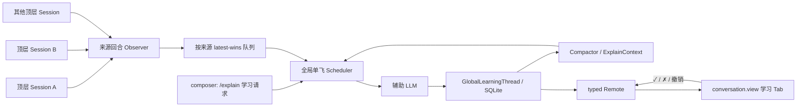
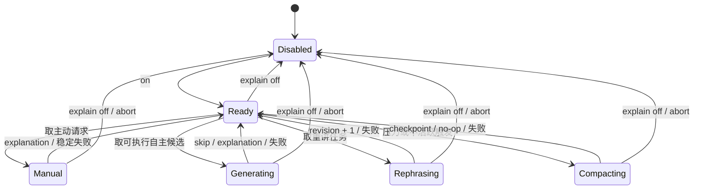

# dsh-explain 技术架构 v10

> 状态：**v10 M6 实现、四插件组合与真实模型闭环完成**（2026-08-14）。产品需求见 [PRD.md](./PRD.md)，实现证据见 [验收矩阵](./ACCEPTANCE.md)。
> v10 保留 v9 的 Host 协议与数据格式，补齐消费方命令发现、点击时 composer 准入、生命周期失效、rc.6 短预测推理约束和组合卸载验证；SQLite schema 不变。

## 架构结论

`dsh-explain` 是一个用户全局、模型调用串行的辅助学习运行时，不是第二个 DSH AgentLoop。

- 多个顶层工作 Session 只提供候选素材。
- 每个来源 Session 最多有一个 Topic 等待反馈；不同来源可以同时等待。
- 全局 Scheduler 一次只运行一个主动讲解、自主讲解、重讲或压缩请求。
- 自主判断受持久化的滚动 24 小时调用预算约束；主动讲解、重讲和压缩不占自主额度。
- 同一 `TopicKey` 全局最多一个活跃讲解，Topic 掌握状态用户全局生效。
- 学习事实存入插件自有 SQLite，不进入主 Session 日志。
- `ExplainContext` 汇总对话偏好、知识概况和学习进展，只进入辅助模型请求。
- 已关闭讲解在 30 分钟无 explain 操作或预计请求压力超过模型容量 50% 时压缩；原始 entries 永久保留供 UI 分页。
- 主模型不可见：不 append 自定义 Session 事件、不 inject、不 steer、不改变 `deriveMessages()`。
- 学习历史与反馈位于 DSH 第一方 `conversation.view` 的「学习」Tab；主动入口复用第一方 composer slash command。每个 Session 有独立视图入口和选中状态，所有入口读取同一份全局数据。



## 作用域

“用户全局”在 P0 中严格指一个 `$DSH_HOME`：

- 数据跨来源 Session、profile、页面刷新和正常进程重启保留。
- fork 与 resume 继续引用同一学习线程，不复制学习状态。
- 来源 Session 删除不级联删除学习记录。
- P0 不跨机器同步，也不支持一个 `$DSH_HOME` 承载多个登录用户。
- 同一 `$DSH_HOME` 只允许一个活动的 dsh-explain host runtime；重复进程由运行租约拒绝，避免两个 Scheduler 同时生成。

## 分发与组合

`dsh-explain` 保持单包 installable profile bundle。P0 不携带外部 UI 插件或 vendored 源码；browser half 复用 DSH web profile 已有的第一方 conversation view ring：

```text
dsh-explain
├── package.json          — dsh.bundle.patch + dsh.client(web) + 第一方 peer dependencies
├── cordis.patch.yml      — 插入唯一 host row（M1 起）
├── src/                  — Node/host half
├── src/client/           — browser half
└── docs/                 — PRD 与技术架构
```

### P0 组合前置条件

1. DSH web profile 组合 `@deepseek-ai/dsh-client-runtime`、`@deepseek-ai/dsh-client-locale`、`@deepseek-ai/dsh-client-ui-slots` 与 `@deepseek-ai/dsh-client-ui-conversation`。
2. host 组合提供 `commands`、`llm`、`tokenMeter`、`settings` 与全局 Session 事件源；explain 声明硬 inject，缺失任一服务时不激活。`tokenMeter` 只用于 `estimateMessage()`，模型容量由 `llm.resolveModelInfo()` 所有。
3. package peerDependencies 声明直接使用的第一方包；`dsh.client.inject` 声明 locale、runtime 与 ui-conversation 的组合元数据。该字段不承担 apply 顺序。
4. client 插件声明实际读取的 `slots`、`locale` 与 `remote` 服务；对 `conversation.view` 的贡献必须通过 `ctx.slots.inject()` 等待真实 slot declaration，不用裸 `slots.register()` 猜测加载顺序。
5. 安装与组合 smoke 使用正常的本地目录安装与 Web profile，断言 `dsh-explain:learning` 在 view ring 中恰好注册一次；第一方视图宿主由 package peer 与 `dsh.client.inject` 声明为必需组合依赖，slot 的实际声明时序仍由 `slots.inject()` 处理。

## 组件结构

```text
src/
├── index.ts              — 唯一 runtime 装配、全局事件观察与 teardown
├── config.ts             — Config 与 settings namespace
├── observer.ts           — 顶层已完成回合 → SourceCapsule
├── queue.ts              — 每 Session latest-wins、来源活跃门与全局有界队列
├── scheduler.ts          — 模型单飞、工作优先级、epoch 与取消
├── explainer.ts          — 辅助 LLM 请求、严格输出解析和边界
├── context.ts            — ExplainContext 组装、实时状态覆盖与 token 计价
├── compactor.ts          — 30 分钟/50% 触发、分批摘要与覆盖提交
├── store.ts              — SQLite 打开、事务、分页、CAS 与 schema 拒绝
├── schema.ts             — 表结构、SCHEMA_VERSION 与行校验
├── feedback.ts           — understood / not-understood / reopen 状态转换
├── gateway.ts            — typed Remote：读取、watch、反馈、设置
├── brands.ts             — TopicId / ExplanationId / EntryId / ObservationId / CheckpointId / RequestId / AutoRequestId
└── client/
    ├── index.ts          — conversation.view 注册、locale 与插件级 client store
    ├── learning-view.tsx — 全局线程、当前讲解、反馈与分页
    ├── settings-view.tsx — UI 可编辑设置、模型目录与只读诊断
    ├── learning-store.ts — revision watch、页面缓存和乐观响应收敛
    └── invariant.ts      — client 组合与 view registration 前置条件
```

v6 不包含 `events.ts`、Session projection、ConversationNodeDefinition 或 turnTail 组件。

## 本地存储

### 路径与配置

默认数据库：

```text
$DSH_HOME/dsh-explain/v1/thread.sqlite
```

`storageDir` 是可配置的绝对或可解析路径；省略时通过 `resolveDshHome(config.dshHome)` 解析默认目录。不得写入来源 Session 的 cwd，也不得根据 `sessionPersistence.locate()` 推导旁路路径。

目录以仅所有者权限创建（POSIX `0700`），数据库首次排他创建为 `0600`。使用 Node 内置 `node:sqlite`，事务负责原子性、并发反馈和分页；启用 WAL 与有界 busy timeout。P0 承诺 SQLite 正常事务语义，不承诺磁盘、内核或硬件在已确认写入后发生损坏时仍能恢复。

### Schema

`SCHEMA_VERSION = 2`。预发布期间不提供隐式迁移：版本不同、结构损坏或约束不满足时加载失败并保留原数据库，禁止删除、覆盖或空库回退。

| 表 | 关键字段 | 角色 |
|---|---|---|
| `meta` | `schema_version`, `store_revision`, `next_ordinal` | 全局格式、CAS revision 与严格递增顺序 |
| `runtime_state` | `first_explain_output_at`, `last_user_action_at`, `activity_generation`, `last_compacted_at`, `context_generation` | 30 分钟计时基线、用户操作代数和压缩脏代数 |
| `topics` | `topic_id`, `topic_key UNIQUE`, `title`, `state`, `topic_revision`, `updated_at` | Topic 身份、`learning / mastered` 状态与实体级 CAS |
| `explanations` | `explanation_id`, `topic_id`, `source_session_id`, `state`, `active_revision`, `rephrase_pending`, `created_at`, `updated_at` | 每来源活跃槽、重讲 revision 与持久化重讲待办 |
| `entries` | `entry_id`, `ordinal UNIQUE`, `kind`, `explanation_id`, `topic_id`, `revision`, `source_*`, `payload_json`, `created_at` | append-only 的讲解、反馈与 Topic reopen 记录 |
| `mutation_requests` | `request_id UNIQUE`, `fingerprint`, `entry_id`, `created_at` | feedback/reopen 的持久幂等账本；多个等价重讲请求可指向同一 entry |
| `context_observations` | `observation_id`, `source_session_id`, `source_turn`, `kind`, `payload_json`, `confidence`, `created_at` | 从有界来源 capsule 提取的对话偏好或 Topic 熟悉度，不保存原文；覆盖关系只以 `observation_coverage` 为准 |
| `context_checkpoints` | `checkpoint_id`, `generation`, `trigger`, `through_ordinal`, `context_json`, `model_json`, `created_at`, `request_id UNIQUE` | 可重建的 `ExplainContext` 快照与成功生成的模型元数据 |
| `context_coverage` | `checkpoint_id`, `explanation_id UNIQUE` | 明确标记哪些已关闭 Explanation 被哪个检查点吸收 |
| `observation_coverage` | `checkpoint_id`, `observation_id UNIQUE` | 明确标记哪些结构化观察被哪个检查点吸收 |
| `auto_request_usage` | `auto_request_id`, `source_session_id`, `provider`, `model`, `attempt`, `started_at` | 自主模型请求的滚动 24 小时持久占额与发送目标；重启不能清零 |
| `runtime_lease` | `name`, `owner_id`, `generation`, `expires_at` | 同一 `$DSH_HOME` 的单 host runtime 租约与 fencing token |

`explanations` 建立两个 partial unique index：`source_session_id WHERE state = 'active'` 和 `topic_id WHERE state = 'active'`。数据库因此直接保证每来源最多一个活跃讲解、同一 Topic 全局最多一个活跃讲解，而不是依赖 Scheduler 的预检查。

每次业务事务令 `store_revision` 加一并返回新值，但客户端写入不以全局 revision 作为互斥条件：反馈校验目标 `ExplanationId + active_revision`，撤销掌握校验 `TopicId + topic_revision`。这样两个不同来源的有效反馈不会因无关写入互相制造 stale；竞争同一实体的写入仍只有一个成功。租约心跳不改变 store revision。分页游标只使用 `ordinal`，不使用时间戳。

`auto_request_usage` 的占额是运行记账，不改变学习线程的 `store_revision`；插入占额或滚动清理后提高 view cursor，使 `explain.status()` 的剩余额度收敛。`started_at` 建立索引，计数范围严格为 `(now - 24h, now]`。旧行可以在预算检查事务中删除，不影响业务历史。

一个 Explanation 只有在 `state = 'closed'` 时才能进入 `context_coverage`；context observation 生成后即可进入 `observation_coverage`。两张 coverage 表是唯一的覆盖关系来源。压缩事务先校验模型请求捕获的 `context_generation`、owner fencing token 和所有 Explanation 覆盖目标仍为 closed，再同时插入 checkpoint、写两类 coverage 并更新 `runtime_state`。失败或取消不会留下部分覆盖。

### 身份与 revision

- `TopicId`：host 为首次出现且通过校验的 `TopicKey` 生成 UUID；客户端不能自造。
- `ExplanationId`：一个 Topic 的一次连续讲解过程；首次讲解生成 UUID。
- `revision`：从 1 开始。✗ 没懂沿用同一 `ExplanationId` / `TopicId` 并严格加一。
- `EntryId`：学习线程中每条 explanation 或 feedback 的 UUID。
- `ObservationId`：一次自主判断接受的结构化 context observation UUID；绑定来源 Session/turn，不能由模型或客户端自造。
- `CheckpointId`：一次成功压缩生成的全局上下文快照 UUID；新检查点完整取代旧检查点进入辅助请求。
- `RequestId`：客户端反馈幂等键；重复请求返回第一次提交结果。对同一活跃 revision 重复点击 ✗ 即使换了 RequestId，也不重复追加 not-understood entry，只重试尚未成功的 rephrase。
- `AutoRequestId`：host 在自主模型请求发送前生成的 UUID，用于持久占额；不由模型或客户端提供。

模型输出的 `topicKey` 必须是 1–80 字符的小写 ASCII 分段键，例如 `git/rebase`，允许 `[a-z0-9._/-]` 且不能有空段。host 只做格式验证和精确键匹配：P0 的去重是 `topicKey` 相等，不是语义相似。

### 持久数据边界

持久化：

- 讲解展示字段、反馈、Topic 状态、全局顺序和来源坐标。
- 每个 Explanation 的 revision 1 entry 中供后续重讲使用的有界 `sourceSummary`，以及自主请求的滚动 24 小时占额。
- 成功生成记录的模型 provider/model、usage 与生成时间。
- 每个来源是否存在等待反馈的 Explanation；该状态由 explanations 显式保存，并在加载时与 entries/topics 交叉校验。
- 最近 explain 用户操作、压缩检查点、覆盖关系、`ExplainContext` 及其推断置信度和来源 ordinal 范围。
- 从来源 capsule 提取的封闭类别 observation、置信度与来源 Session/turn；observation 不保留支撑它的原始用户文字。

不持久化：

- 完整主 Session 转录、system prompt、原始工具输出。
- 尚未处理的自主候选和普通自主模型失败。
- 除 revision 1 entry 的 `sourceSummary` 外，当次自主判断结束后的来源 capsule 和任何未提交模型输出。
- 当前 Session 的视图选择、composer draft 与其他 conversation UI 状态；这些由第一方 conversation client store 所有，不进入学习数据库。

## 来源观察

host 在根作用域注册一个 `{ global: true }` 的 `session/event` listener，并只在以下条件全部满足时构造候选：

1. 全局开关为 on。
2. `session.header.origin !== 'subagent'`。
3. 到达 `turn/end` 且 `reason.kind === 'completed'`。
4. 该 turn 至少有一个 step，并包含非空、非 explain 注入的 assistant 文本。
5. `(sessionId, turn, endSeq)` 尚未被当前 runtime 接收。

事件 listener 只做常数级 gate，捕获 Session 引用、不可变的 `turn/end` 事件与当前 runtime generation，并把 capsule 构造排入微任务后立即返回；不得在同步 `session/event` dispatch 中渲染全文、访问磁盘或等待模型。异步 capture 只读取截至该 `endSeq` 的 append-only 事件切片，并在入队前再次校验 enabled 与 generation，避免 off 或模型语义设置变化后补入旧候选。

`SourceCapsule` 包含：

```ts
interface SourceCapsule {
  sourceSessionId: SessionId
  turn: number
  endSeq: number
  observedAt: number
  cwdLabel?: string
  userText: string
  assistantText: string
  tools: readonly { name: string; resultPreview?: string }[]
  truncated: boolean
}
```

capsule 只存在内存中。`cwdLabel` 只使用工作区显示名或 basename，不记录绝对路径。渲染器按当前 turn 的 surface 语义收集文本，排除 reasoning 和二进制内容；总字符数由 `maxSourceChars` 限制，默认 24,000，超限时保留首尾并设置 `truncated`。字段进入模型前再次限制单字段长度。

### 重讲来源摘要

自主结果成功创建 Explanation 时，host 从该次 `SourceCapsule` 生成以下内部字段，并只写入 revision 1 explanation entry 的 `payload_json.sourceSummary`：

```ts
interface PersistedSourceSummary {
  userText: string
  toolNames: readonly string[]
  cwdLabel?: string
  truncated: boolean
}

interface ExplanationEntryPayload {
  title: string
  what: string
  why: string
  pitfall: string
  origin?: 'manual' | 'selection' | 'suggested'
  sourceSummary?: PersistedSourceSummary
}
```

`sourceSummary` 在 revision 1 必需、在 revision 2 及以后禁止；后续 revision 通过 `ExplanationId` 读取首个 entry。自主讲解的 `userText` 来自当前来源 turn；显式讲解的 `userText` 来自命令请求。两者先规范化空白，再按首尾保留截断到固定 2,000 字符；`toolNames` 只保留调用名，按首次出现去重且最多 32 个；`cwdLabel` 沿用 capsule 中不含绝对路径的显示值，最长 160 字符。三项上限是持久化隐私格式约束，不接受 Config/settings 放宽。`truncated` 表示 userText 或工具名列表发生截断。摘要不包含 assistant 全文、工具参数、工具结果、reasoning、system prompt、绝对路径或其他 turn。来源 Session 删除后该读取路径仍然成立。`threadPage` 的客户端 DTO 必须剥离 `sourceSummary`，P0 不在 UI、Remote 或日志中回显它。Compactor 构造 closed Explanation 输入时也必须剥离该字段；它只用于活跃 Explanation 的 rephrase。三种非自主 `origin` 都随后续 revision 保留并可向 UI 投影；旧 entry 没有该字段时解释为自主来源，不需要 schema 迁移。

### 主动命令捕获

`/explain <request>` 由 DSH command runtime 先写标准 `command/run`，再调用插件 handler；因此原始命令输入可由来源 Session 日志重建，且不会成为主 Agent message。handler 规范化并按 `maxSourceChars` 限制请求，再根据封闭变体构造显式来源：

- 普通请求反向选择最近一个符合普通 Observer 规则的 completed turn；没有时使用 `turn = 0`。
- `--selection <text>` 从当前 Session 事件中逆序查找包含规范化选中文本的最新消息。assistant 或 tool result 使用本 turn；user 或 context 消息使用它之前最近的合格已结束 turn；重复文本取最新匹配。无可靠匹配时使用 `turn = 0`，选中文本仍是请求事实。
- `--suggested <turn> <request>` 只读指定 turn，防止草稿停留期间的新回合使来源漂移。显式快捷入口允许 `completed` 或 `max-tokens` 结束回合，但不放宽自动 Observer 的 completed-only 规则。指定 turn 不存在或不合格时返回 `EXPLAIN_SOURCE_UNAVAILABLE`，不回退到其他回合。

三种变体都不补扫其他 Session，也不持久化完整 assistant 或工具结果。selection 匹配只决定有界 capsule，reasoning 和工具参数不参与搜索；它们只有在用户选中文本本身进入标准 command 日志时才成为该次请求的一部分。

### M6 可选消费方集成

`dsh-selection-chat` 与 `dsh-suggested-replies` 只通过当前 Session 的 `remote.commands.list(sessionId)` 发现 `explain`，再通过公开 conversation input facade 写入草稿。两者不导入 Explain 包、不读取 SQLite/Remote DTO，也不调用 submit。按钮点击时重新读取当前 Session、`phase === 'plain'` 与空草稿，避免渲染后切换 Session、开始提交或用户输入造成覆盖。

命令能力缓存分别响应 `commands/change`、对应 Session 的 `agent-preset/selected` 和全局 `connection/reset`；异步查询同时绑定 Session 与组件/选区 epoch，迟到结果不能恢复旧入口。selection-chat 保留单消息、单次消费、10,000 字符和换行的既有选区约束。suggested-replies 的“学习刚才的回答”是 ready 行附件，不是第四个模型候选；它读取 sidecar 已固定的 turn，不写 sidecar，不改变 `suggestionCount = 3`、`maxTokens = 384` 或 `timeoutMs = 15000`。

DSH rc.6 默认模型推理强度会占用短结构化预测的输出预算，因此 suggested-replies 把辅助调用的 `suggestionReasoningEffort` 暴露为 Config，默认 `off`，并在内部 Agent 的 `agent/request` waterfall 中显式设置。这个兼容修复不增加 token/时间预算，也不影响主 Session 路由。Advisor 不建立运行时桥接；其 `source.kind = advisor` 可见 context 只有被用户真实选择后才经 selection-chat 进入一次 `/explain --selection` 请求。

## 全局调度

### 状态机



来源会话的活跃 Explanation 是持久业务状态，不是全局 Scheduler 状态。再次 on 后 Scheduler 恢复为 `Ready`；它可以重讲任意已提交 ✗ 的目标，也可以为没有活跃讲解的来源处理候选，但不能绕过任何来源自己的等待反馈门。

### 队列规则

- 每个来源 Session 最多一个自主候选；新候选替换该 Session 的旧候选。
- 每个来源 Session 最多一个待处理或在途主动请求；来源已有活跃 Explanation 时在入队前返回 `EXPLAIN_SOURCE_BUSY`。
- `maxPendingCandidates` 默认 8，作为 Config/settings 字段可修改。
- 达到上限时丢弃最旧的自主候选并记录 debug 日志。
- 来源存在活跃 Explanation 时不取该来源的自主候选；其他来源不受影响。
- 可执行自主候选按 `observedAt` 最早优先；繁忙来源不能通过持续替换让其他来源饥饿。
- 预算允许时才取自主候选；`maxAutoRequestsPerDay` 耗尽时保留各来源 latest-wins 候选，并为最早占额的 24 小时过期点设置一次唤醒。新候选仍按来源替换，队列总上限仍生效。
- ✗ 产生的 rephrase 工作不进入自主候选上限，按反馈 entry 的全局 ordinal 处理。
- 工作优先级为：当前目标请求必需的压力压缩、主动请求、rephrase、可执行自主候选、不活跃压缩。新主动请求可以取消在途自主生成或 idle 压缩并在其清理后先运行；它不抢占已在途的主动请求或 rephrase。压力压缩完成后回到原目标重新组装和计价，不能直接复用压缩前请求。
- 反馈事务必须先通过目标 Explanation 的 active revision 校验。只有已接受的反馈才能改变 Scheduler：✓ 取消同一讲解尚未完成的 rephrase；✗ 在没有同一 rephrase 在途时立即启动或重试。陈旧反馈不取消任何工作。

### 自主调用预算

`maxAutoRequestsPerDay` 默认 50，含义是全局滚动 24 小时内最多向 provider 发送 50 个自主判断请求，不是自然日配额。Scheduler 在为自主目标执行压力压缩前先只读检查预算；已耗尽时不发起与该目标相关的压力压缩。目标通过压力检查后、真正调用 provider 前，再在一个 SQLite 事务中删除 `started_at <= now - 24h` 的旧占额、重新计数并插入新的 `AutoRequestId`。第二次检查失败时目标回到候选队列等待。

占额提交成功即计数，因此 provider 失败、超时、取消、迟到丢弃和 `maxAttempts` 重试都各消耗一次；进程在占额后、发送前崩溃也保守计数，确保任何崩溃路径都不能突破消费上限。自主模型返回 `skip` 同样计数。主动请求、用户提交 ✗ 产生的 rephrase 和 Compactor 请求不写该表；它们仍受全局单飞、上下文阈值与超时约束。设置提高或最早占额过期时立即重新调度，设置降低时不撤销在途请求，只阻止后续自主发送。

### 单飞与迟到结果

Scheduler 全局最多持有一个 `AbortController` 和一个模型 promise。每次 on/off、反馈状态变化、runtime 重建和 teardown 都可能提高 `generationEpoch`。模型结果提交前必须同时满足：

- 信号未取消。
- 捕获的 epoch 等于当前 epoch。
- 全局开关仍为 on。
- runtime lease 的 owner + generation 仍匹配。
- 自主生成时目标来源仍无活跃 Explanation、候选仍是该来源最新项；输出 Topic 未掌握且未在其他来源活跃。
- 主动生成时命令信号仍有效、目标来源仍无活跃 Explanation，且输出 Topic 未在任何来源活跃；已掌握 Topic 可由显式请求原子恢复为 learning。
- 重讲时目标仍是相同 `sourceSessionId + ExplanationId + revision`。
- 压缩时捕获的 `contextGeneration` 未变化，所有拟覆盖 Explanation 仍为 closed 且未被覆盖。

任一条件不满足即丢弃结果，不写数据库。

### 多进程租约

插件加载时在 SQLite 事务中获取 `runtime_lease('explainer')`。owner 使用进程内随机 UUID；每次新 owner 接管都递增不可回退的 `generation` fencing token。租约协议常量为每 5 秒续约、15 秒过期：

- 存在未过期的其他 owner 时，第二个 host row 明确加载失败。
- 正常 teardown 主动释放。
- 进程崩溃后，下一实例最多等待租约过期后接管。
- 每次模型结果和业务事务提交都验证当前 owner + generation；旧 owner 在暂停后恢复也不能提交。续约更新不到自身 generation 时，runtime 立即 abort 并进入失败状态。
- 文件锁和 PID 不能证明进程仍存活，因此不用于抢占判断。

## 辅助模型调用

### 路由

`provider` 与 `model` 是用户全局设置。默认关闭允许二者为空；执行 `/explain on` 或设置页启用时，任一缺失都返回 `MODEL_ROUTE_REQUIRED`。host 通过 `ctx.llm.resolveModelInfo(provider, model)` 读取精确路由容量；adapter 未提供 `context.contextWindow` 时返回 `MODEL_CONTEXT_REQUIRED`。容量必须配置在拥有该 route 的 adapter，不在 explain 中维护第二份漂移值。不得从来源 Agent、最近 Session 或默认 adapter 隐式选择模型。辅助任务只需短结构化输出；若精确模型公开 `off` 推理强度，explain 为每次辅助调用显式选择 `off`，否则保留 adapter 的默认推理策略。

### 请求上下文

一次自主请求按以下顺序组装：

1. 固定 explain system prompt 与严格 JSON 输出 schema。
2. 最新压缩检查点的 `ExplainContext`；没有检查点时使用空基线。
3. 数据库实时覆盖层：所有来源活跃讲解摘要、最近更新的 `maxTopicHints` 个 TopicKey 与权威状态、掌握/学习/重复没懂计数。
4. 尚未纳入检查点的结构化 context observations、已关闭讲解和反馈尾部。
5. 当前 `SourceCapsule`。

一次重讲请求使用同一全局基线和实时覆盖层，再加入目标讲解的全部 revisions、该目标的 `not-understood` 反馈和 revision 1 entry 持久化的 `sourceSummary`；不读取来源 Session。缺少或无法解析摘要属于数据库不变量破坏，返回 `EXPLAIN_SOURCE_SUMMARY_INVALID`，不能降级成无来源重讲。实时覆盖层按结构化字段拼接，永远覆盖旧检查点中相冲突的 Topic 状态。

一次显式请求使用同一全局基线和实时覆盖层，再加入规范化的 `manualRequest`、`requestOrigin` 与已按上述规则定位的有界 capsule。prompt 要求输出语言跟随 `manualRequest`，并禁止 `skip` 与 context observation；生成只回答用户显式学习目标，不利用命令去修改主 Agent。完整渲染后与自主/重讲一样计价和执行压力压缩。

每个请求完全渲染后，把固定 system prompt 和各条 user/assistant 内容都表示为对应 role 的临时 `Message`，逐条调用 `ctx.tokenMeter.estimateMessage()` 并加上 `maxOutputTokens` 预留；辅助调用不携带工具 schema。分母来自 `resolveModelInfo().context.contextWindow`。这是 DSH 固定启发式，不声称等于 provider tokenizer。占用大于 `contextThresholdRatio = 0.5` 时，目标工作转入压力压缩；压缩后必须从数据库重新组装并重新计价。

## 压缩与 `ExplainContext`

### 可压缩集合

只有 `state = 'closed'` 且在 `context_coverage` 中不存在记录的 Explanation，以及在 `observation_coverage` 中不存在记录的 context observation 可压缩。活跃 Explanation 的所有 revisions 与反馈始终逐字进入实时覆盖层，不受其创建时间影响。原始 entries 从不删除或改写；`threadPage` 也不读取 checkpoint 代替历史。

Compactor 的输入是上一检查点、按时间排序的一批未覆盖 observations/Explanation，以及数据库生成的最新权威统计。批次按“完整压缩请求 + `maxCompactionOutputTokens` 不超过 `contextThresholdRatio`”动态选取；一次无法容纳时分批生成中间检查点，直到目标 explain 请求降到阈值以内或没有可压缩项。新检查点是完整快照而非增量补丁，成功后替代旧检查点进入模型请求。

### 双触发器

- `IdleTrigger`：存在未覆盖 observation 或 closed Explanation，且 `now - (last_user_action_at ?? first_explain_output_at) >= idleCompactMs`。成功 `/explain on`、用户反馈或 reopen 更新 `last_user_action_at`；status、视图 mount、分页、watch、刷新和模型活动不更新。
- `PressureTrigger`：待执行主动、自主或重讲请求的预计占用严格大于 `contextThresholdRatio`。Scheduler 在目标调用前运行必要压缩。
- 同一个 `{ contextGeneration, activityGeneration }` 的 idle 检查最多启动一次。无可压缩项是 no-op，不产生 LLM 调用；新 observation、Explanation 关闭或成功用户操作分别推进对应 generation 并重新布置 timer。
- idle 压缩失败保留脏代数并记录稳定状态，等下一次用户操作后的新 idle 周期、新 closed Explanation 或后续压力触发；压力压缩失败返回 `EXPLAIN_COMPACTION_FAILED`，原目标不继续调用模型。
- 若全部可压缩项已成功覆盖而目标请求仍大于 50%，返回 `EXPLAIN_CONTEXT_PRESSURE_UNRESOLVED`。不得静默删除活跃讲解、缩短 `ExplainContext` 字段或绕过阈值。

### 压缩输出协议

压缩输出经过严格 schema 校验：

```ts
interface ExplainContextSnapshot {
  dialogueProfile: readonly {
    kind: 'verbosity' | 'structure' | 'examples' | 'terminology'
    preference: string
    confidence: 'low' | 'medium' | 'high'
    evidenceObservationIds: readonly ObservationId[]
    evidenceEntryOrdinals: readonly number[]
  }[]
  knowledgeOverview: string
  learningTrend: string
}
```

证据 id/ordinal 只能引用本次新增输入，或上一检查点已经校验通过的证据集合；持久化前再次校验底层 observation/entry 仍存在并执行数量上限。模型不能在快照中写 Topic 的权威 `mastered / learning` 状态，这些值每次从 topics/explanations 实时生成。`dialogueProfile` 最多 16 项，每项证据最多 8 个；`preference` 最大 240 字符，`knowledgeOverview` 和 `learningTrend` 各最大 2,000 字符。偏好种类使用封闭枚举，拒绝额外字段和无法归因的偏好；prompt 明确禁止职业、身份、健康、政治等敏感属性推断。解析失败不写 checkpoint 或 coverage。

## 讲解决策输出

```ts
type ContextObservation =
  | {
      kind: 'dialogue-preference'
      dimension: 'verbosity' | 'structure' | 'examples' | 'terminology'
      value: string
      confidence: 'low' | 'medium' | 'high'
    }
  | {
      kind: 'topic-familiarity'
      topicKey: string
      level: 'unknown' | 'beginner' | 'working' | 'advanced'
      confidence: 'low' | 'medium' | 'high'
    }

type ExplainDecision = ({
  kind: 'skip'
  reason: 'already-known' | 'not-useful' | 'insufficient-context'
} | {
      kind: 'explain'
      topicKey: string
      title: string
      what: string
      why: string
      pitfall: string
}) & { contextObservations: readonly ContextObservation[] }

interface RephraseDecision {
  title: string
  what: string
  why: string
  pitfall: string
}

interface ManualExplanation {
  topicKey: string
  title: string
  what: string
  why: string
  pitfall: string
}
```

模型 JSON 是不可信边界：拒绝额外字段、非法 TopicKey、空白展示字段、超长字段和非字符串值。`contextObservations` 最多四项，`value` 最大 240 字符；host 为接受的观察生成 ObservationId，并绑定当前来源 Session/turn，观察本身不能关闭或掌握 Topic。`title` 最大 120 字符，`what / why / pitfall` 各最大 2,000 字符。主动讲解的展示字段沿用命令请求语言，自主讲解沿用当前来源用户文本语言，rephrase 沿用已有讲解语言；Compactor 请求显式携带由上一检查点、最新讲解标题或最新对话偏好依次选出的 `languageSample`，所有展示字段沿用该样本文本的语言。样本含有可区分的非拉丁书写系统时，host 还要求每个非空展示字段保留该书写系统；不符合时整项解析失败且不写检查点。主动请求必须返回 `ManualExplanation`，不能 skip 或产生 context observation；rephrase 只能返回 `RephraseDecision`，不能改变 `TopicKey` 或产生 context observation。解析失败按模型失败处理，不能把原文回退成展示内容。

接受一个自主结果时，host 在同一事务中重新校验来源候选、来源活跃槽和 Topic 状态，写入 observations，并按 decision 写入或跳过 Explanation。创建 Explanation 时，revision 1 entry 同时写入该候选的 `sourceSummary`；新建或既有 Topic 的 `topics.title` 都更新为本次成功提交的标题，并提高 `topicRevision`。结果产生 observation 或 Explanation 时才首次设置 `first_explain_output_at` 并提高 `storeRevision`；新 observation 另提高 `contextGeneration`。没有 observation 的 skip 不写业务数据。任一约束失败时整项结果丢弃，不能只提交画像推断而丢弃其过期来源判断；自主调用占额已经发生且不回退。

成功提交 rephrase 时也把 `topics.title` 更新为该 revision 的最新标题并提高 `topicRevision`。entries 是 append-only：任何旧 revision 的标题保持生成时原值，`maxTopicHints` 和实时覆盖层读取 `topics.title`。标题变化不得改变 `TopicKey`、掌握状态或其他来源的 Explanation。

接受显式结果时，host 在一个事务中重新校验 lease、来源活跃槽和 Topic 活跃门，必要时把既有 mastered Topic 恢复为 learning，创建新的 Explanation revision 1，并把请求的 `manual | selection | suggested` origin、有界 `sourceSummary` 与 generation 写入 payload。显式请求成功是 explain 用户操作：更新 `last_user_action_at`、`activityGeneration` 和 `storeRevision`，但不写 `auto_request_usage`。Topic 或来源竞争失败时整个结果丢弃并返回稳定冲突。

### 超时与失败

- `timeoutMs`、`maxOutputTokens`、`maxCompactionOutputTokens`、`maxSourceChars`、`maxPendingCandidates`、`maxAutoRequestsPerDay`、`idleCompactMs` 与 `contextThresholdRatio` 都是可配置字段；不得在运行路径隐藏默认值。持久化来源摘要的隐私上限是固定格式约束，不属于部署调优项。
- 自主候选失败最多按 `maxAttempts` 重试，默认 2；耗尽后丢弃候选并记录日志，不污染学习线程。
- 重讲失败时，已提交的 not-understood 反馈保留；线程仍停留在原 revision，UI 显示失败并允许用户再次点击 ✗。同一 `RequestId` 不重复追加反馈。
- provider 返回的 usage 在成功生成 explanation、rephrase 或 checkpoint 时随对应记录持久化；自主调用占额独立记录已发送的失败和重试。失败细节进入 host 日志，用户界面只接收稳定错误码和安全消息。
- 主动命令把 disabled、runtime 不可用、来源繁忙、Topic 活跃、请求取消、模型失败、压缩失败或无法降压映射为稳定 `EXPLAIN_*` 结果；不得把 provider 异常文本回显给用户。

## 反馈状态转换

### ✓ understood

请求目标必须是当前来源的活跃 `sourceSessionId + ExplanationId + revision`。事务追加 feedback entry，将 Topic 设为 `mastered`，关闭该 Explanation，提高 `topicRevision`、`contextGeneration`、`activityGeneration` 与 `storeRevision`，并更新 `last_user_action_at`。其他来源的活跃 Explanation 不变。提交成功后 Scheduler 才允许处理该来源等待的自主候选。

### ✗ not-understood

事务先幂等追加 feedback entry，将目标 Explanation 的 `rephrase_pending` 设为 1，Topic 保持 `learning`，目标 Explanation 保持活跃，提高 `activityGeneration` 并更新 `last_user_action_at`；Scheduler 随即把该持久待办加入 rephrase 队列。成功后追加同一来源、同一 Explanation 的 `revision + 1`，清除 `rephrase_pending`，更新 `topics.title` 与 `topicRevision`，新 revision 成为该来源唯一可反馈项。若该 revision 已有 not-understood entry 但重讲尚未成功，再次点击 ✗ 只在 `mutation_requests` 中把新 RequestId 指向原 entry 并重新调度，不追加重复反馈；重启按 `rephrase_pending` 恢复，而不是从展示文本猜测待办。

### 撤销掌握

`topic.reopen` 校验 `topicRevision`，将 Topic 从 `mastered` 改回 `learning`，提高 `topicRevision` 与 `activityGeneration`，追加审计 entry 并更新 `last_user_action_at`。它不恢复旧 Explanation 为活跃，也不立即调用模型；未来相同 TopicKey 可以再次产生新的 ExplanationId。

### 竞争规则

反馈 Remote 必须携带：

```ts
interface FeedbackRequest {
  requestId: RequestId
  sourceSessionId: SessionId
  explanationId: ExplanationId
  revision: number
  action: 'understood' | 'not-understood'
}
```

- 同一 `requestId` 重放返回第一次结果。
- 目标不是所声明来源的当前活跃 revision 时返回 `STALE_EXPLANATION_REVISION`；客户端随后刷新 status 与最新页，不在失败对象中复制一份可能再次过期的来源状态。
- 不同来源的反馈没有共享 expected-store gate，可以在各自事务中依次成功；同一 Explanation 的竞争由 active revision 和幂等约束裁决。
- `reopenTopic` 携带 `expectedTopicRevision`；不匹配时返回 `STALE_TOPIC_REVISION`。
- 事务成功后 Remote 返回新的 `storeRevision` 和受影响条目；客户端不得猜测最终状态。

## Host–client 数据通道

学习数据不走 Session projection。host 维护独立的 `ViewCursor { incarnation, revision }`：进程启动生成新 incarnation，任一学习事务、resolved settings 变化或 runtime 状态变化都令 revision 加一。watch cursor 只负责客户端刷新；数据库 `storeRevision` 负责快照排序和缓存收敛，不能替代 Explanation/Topic 的实体 revision。host 通过 typed Remote 暴露专用 namespace：

| 方法 | 作用 |
|---|---|
| `explain.status()` | 全局开关、模型路由/容量完备性、runtime 状态、活跃来源数、候选数、自主额度已用/上限/最早恢复时间、最近操作/压缩时间、当前压力、store revision 和 view cursor |
| `explain.threadPage({ beforeOrdinal, limit })` | 按 ordinal 倒序分页，limit 默认 30、最大 100；返回读取时的 store revision |
| `explain.context()` | 最新 `ExplainContext`、生成时间、推断标记和数据库实时学习统计 |
| `explain.watch({ after: ViewCursor })` | 最长 25 秒 long-poll；cursor 变化时返回新 cursor，incarnation 不同则立即返回，无变化返回 timeout |
| `explain.feedback(request)` | Explanation revision CAS + 幂等提交 understood / not-understood |
| `explain.reopenTopic(request)` | Topic revision CAS + 撤销全局掌握状态 |
| `explain.setEnabled({ enabled })` | 写 settings；开启前验证模型路由与容量 |
| `explain.configuration()` | 当前 UI 可编辑字段与 DSH settings namespace 的原生 revision |
| `explain.modelCatalog()` | 当前 provider 与建议模型目录；目录只提供选择建议 |
| `explain.updateConfiguration(request)` | expected-revision CAS 合并 UI 四字段；开启或切换已启用路由前验证精确容量 |

Remote 走 DSH `TypertRemoteService` 和 trusted-host authority，不新增未声明认证语义的可变 REST 端点。每个输入在 wire 边界校验；业务错误使用稳定 code，不从异常文本推导。DSH 0.1.0-rc.6 的生成客户端把传输结果封装为 `RemoteResult<T>`；browser store 先解封传输结果，再处理方法自身的业务结果，传输失败进入现有可见错误状态。

browser 的插件级 `learning-store`：

- client plugin apply 时创建一次，在 Session 视图实例之间保留缓存；不得在每个 `LearningView` 内创建独立业务 store。
- `LearningView` 挂载时激活引用计数式 `watch`；view cursor 变化后刷新 status 与最新页。当前 view 不是「学习」时，该 entry 不挂载。
- 最后一个 `LearningView` 卸载、连接断开或 fiber dispose 时取消 long-poll；Session 切换后的新实例复用同一 store 并追平 cursor。
- feedback 成功后刷新当前已物化页数；不同条目的 pending 状态按 EntryId 隔离，随后 watch 负责与 host 收敛。
- 刷新同时读取 status、`ExplainContext` 与当前已物化的历史深度；checkpoint 变化不缩短用户已加载的历史范围。
- reconnect 先读取 status 和最新页，不信任 localStorage 中的旧业务数据；host incarnation 变化必定使旧 watch cursor 失效。
- 设置页与学习视图复用同一个 store 和引用计数；任一页面已挂载时只存在一个 long-poll。configuration 随 refresh 更新，模型目录只在设置页打开后加载。
- 设置提交的 pending/error 与学习条目 mutation、Remote 传输错误分别建模。`SETTINGS_STALE` 后刷新到胜出 revision，客户端不得自动重放旧草稿。

## `settings.section` 集成

client half 通过 `ctx.slots.inject('settings.section', ...)` 注册「学习」页面，等待第一方设置壳层的真实 declaration，并在 collapse/redeclaration 时随 effect 移除和恢复。页面只开放 `enabled`、`provider`、`model` 和 `maxAutoRequestsPerDay`；其余高级字段继续由 composition/settings 文件管理。

Host 使用 `ctx.settings.describe()` 读取 `dsh-explain` namespace 的原生 revision，并使用 `ctx.settings.update(namespace, patch, expectedRevision)` 提交一次 merge。插件不维护平行 revision，也不 `replace()` user section。开启或在已开启状态下修改路由时，先对目标 settings 调用 `resolveModelInfo()` 并要求精确 `contextWindow`；验证、schema 或 CAS 任一失败都不写部分设置。成功后 Runtime 从 owner scope 同步 Scheduler，设置页与 `/explain status` 读取同一状态。

`modelCatalog()` 合并 `ctx.llm.listProviders()` 与各 provider 的 `listModels()` 结果。建议模型目录为空或单个 provider 查询失败时仍允许显式输入 model id；目录不是路由许可，启用条件始终由精确模型解析决定。`llm/adapters-updated` 提高 view cursor，使已加载目录的设置页重新读取。

诊断展示按以下顺序纯派生：关闭、runtime 失败、路由未配置、额度耗尽、正常等待。额度耗尽展示最早恢复时间；压力和最近压缩只在 Host 返回对应事实时展示。Remote 传输失败单独呈现并保留缓存，不与业务状态合并成“空历史”。

## `conversation.view` 集成

client half 沿用第一方 `ui-trajectory` 的 view-ring 模式。类型程序引入 `@deepseek-ai/dsh-client-ui-conversation/client` 的 `SlotMap` 声明；运行时使用 slot service：

```ts
const learning = createLearningStore(ctx.remote.explain)

ctx.slots.inject('conversation.view', () => ctx.slots.register({
  name: 'conversation.view',
  id: 'dsh-explain:learning',
  order: 20,
  locale: NS,
  label: () => t('view.learning'),
  inject: (): LearningViewInjected => ({ learning }),
}, LearningView))
```

约束：

- `conversation.view` 是 Session-scoped。组件接收当前 `sessionId`，只用它把该来源的活跃讲解置顶或显示“当前会话暂无讲解”；它不分割学习线程或 client store，所有实例读取同一个全局 Remote。
- 当前 view id 属于每个 Session 的 conversation store。Session A 选中「学习」不会令 Session B 自动选中，但两者打开后看到同一 thread revision。
- 注册必须使用 `ctx.slots.inject('conversation.view', ...)`，使贡献项等待真实 declaration、随 declaration collapse 卸载，并在 redeclaration 后重建。
- Tab 列表已是唯一入口。P0 不向 `conversation.session.header.actions` 添加重复的“打开学习”按钮，也不访问 conversation 私有 store 或 DOM 来切换 view。
- P0 不自动切换、不抢焦点。当前公开 conversation service 不提供跨插件 `setView`；未来主动显现需求先由第一方宿主提供公开、可测试的操作。
- 空白 Session 的 Hero 阶段隐藏会话头部并不渲染活动 view，因此没有「学习」入口；P0 接受用户先进入一个已建立的 Session。
- 学习 view 只替换聊天记录区域。ConversationRoot 继续拥有当前工作 Session 的 composer；插件不通过跨包 CSS 或 DOM 操作隐藏、禁用或改道它。
- 学习业务数据不进入 conversation store 或 localStorage；后者只持有 view 选择、draft 等 UI 状态。
- 每个活跃 Explanation 的最新 revision 都独立显示 ✓ / ✗；反馈目标显式携带来源 Session 与 Explanation 身份，不能依赖“线程最后一条”。
- `manual | selection | suggested` origin 分别显示本地化“主动请求”、“选中解释”和“学习建议”元信息；`sourceTurn = 0` 只表示无可靠来源坐标，不渲染成真实回合。
- M4 订阅公开的 `ctx.sessions.list`，以 `byId[sourceSessionId]` 判定来源是否仍在当前 inventory。非当前且可见的来源通过 `ctx.sessions.open(sourceSessionId)` 打开；当前来源不显示重复动作。缺失来源保留历史并显示不可用，不读取 Session 文件、不操作 conversation 私有 store，也不改变目标 Session 当前 view。

## 生命周期

### 启用

1. 校验 provider/model、精确模型 `contextWindow` 与 store 可用。
2. 持久化全局 enabled 设置，把成功启用记为 explain 用户操作并提高 `activityGeneration`。
3. 提高 epoch，恢复未完成 rephrase 与 idle timer，并开始接收未来 turn 候选。
4. 各来源已持久化的活跃 Explanation 继续等待；Scheduler 统一进入 Ready。

### 禁用

1. 先将 enabled 持久化为 false。
2. 提高 epoch 并 abort 在途请求。
3. 清空内存自主候选。
4. 以 `EXPLAIN_DISABLED` 结算尚未开始的主动命令，保留数据库历史、Topic 状态、各来源未关闭 Explanation、checkpoint 与 `ExplainContext`；重新启用后继续等待其反馈。
5. client 仍可读取历史，但 `feedback` 与 `reopenTopic` 返回 `EXPLAIN_DISABLED`，不产生业务事务。

### Teardown

停止接收候选，提高 epoch，abort 请求，等待持有的 promise 静止，取消 Remote watch waiters，关闭数据库并释放 runtime lease。teardown 不等待主 Agent，也不向 Session 写结束事件。

### 重启恢复

- 学习 entries、Topic 状态、全局顺序、各来源未关闭 Explanation、压缩覆盖和 `ExplainContext` 从 SQLite 恢复。
- 未处理自主候选和崩溃时的自主生成不恢复；下一次新工作回合继续驱动。
- 已提交 not-understood 但尚未产生下一 revision 时，按 feedback ordinal 恢复多个 rephrase 工作并继续全局单飞。
- idle timer 从持久化的 `last_user_action_at ?? first_explain_output_at` 恢复；已经成功覆盖的 generation 不重复压缩。
- 恢复不读取或修改来源 Session 日志。

## 对主系统的影响

| 维度 | v6 保证 |
|---|---|
| 主模型历史 | 不变；无 explain Session 事件和消息注入 |
| 主 turn 控制流 | 不等待 explain 模型或数据库反馈流程 |
| 主 Session 持久化 | 不包含学习事实；主动请求只产生 DSH command runtime 已定义的 `command/run` / `command/done` 事件 |
| 资源 | explain 仍共享宿主进程、模型配额、网络和磁盘，可能产生间接竞争 |
| 隐私 | 发送给辅助模型的来源素材受限；完整转录默认不落 explain 数据库 |

## 配置

所有部署可变选择都进入 Config/settings：

| 字段 | 默认值 | 说明 |
|---|---:|---|
| `enabled` | `false` | 全局开关 |
| `provider` | 无 | 辅助模型 provider；启用时必需 |
| `model` | 无 | 辅助模型 id；启用时必需 |
| `dshHome` | `$DSH_HOME` / `~/.dsh` | 默认数据与 settings 根 |
| `storageDir` | `<dshHome>/dsh-explain/v1` | SQLite 所在目录 |
| `maxPendingCandidates` | `8` | 自主候选上限 |
| `maxSourceChars` | `24000` | 单次来源 capsule 上限 |
| `maxAutoRequestsPerDay` | `50` | 全局滚动 24 小时自主请求发送上限；失败与重试计数 |
| `maxTopicHints` | `100` | 模型看到的最近 TopicKey 状态数 |
| `idleCompactMs` | `1800000` | 成功 explain 操作后触发不活跃压缩的时长（30 分钟） |
| `contextThresholdRatio` | `0.5` | explain/压缩请求允许占所选模型 contextWindow 的最大比例；严格大于时先压缩 |
| `timeoutMs` | `30000` | 单次辅助模型超时 |
| `maxOutputTokens` | `1200` | 单次输出上限 |
| `maxCompactionOutputTokens` | `1600` | 单次 `ExplainContext` 输出上限 |
| `maxAttempts` | `2` | 自主候选最大尝试次数 |

`dshHome` 与 `storageDir` 只允许在 composition Config 中设置，运行期间不可切换数据库。其余字段由 settings user layer 覆盖 composition base；运行时读取已解析值。M4 设置页只编辑 `enabled/provider/model/maxAutoRequestsPerDay`，以一次 revision-CAS merge 保留高级字段。`idleCompactMs` 与 `maxAutoRequestsPerDay` 必须是正整数；`contextThresholdRatio` 必须大于 0 且小于 1。会影响在途请求语义的设置变化提高 epoch 并取消旧请求；自主额度上限变化不取消在途请求，只重新判断后续候选；其他只影响未来调用的边界值在下一工作项生效。

## 测试策略

### 单元测试

- TopicKey、模型 JSON、SourceCapsule 与分页游标校验。
- 状态机、按来源 latest-wins、来源活跃门、公平选择、工作优先级和 epoch fencing。
- 显式请求捕获、selection 逆序匹配、suggested 精确 turn、空白/失效来源、严格非 skip 输出、稳定结算、取消、来源/Topic 门和自主预算豁免。
- revision 1 `sourceSummary` 生成、字段上限、Remote 剥离、来源删除后的重讲与损坏拒绝。
- 滚动 24 小时边界、发送前持久占额、失败/重试计数、候选暂停恢复和重讲豁免。
- 新 Explanation 与 rephrase 对 `topics.title/topicRevision` 的更新，以及旧 entry 不变。
- ExplainContext schema、证据 ordinal、实时状态覆盖、token 计价和 50% 严格边界。
- 30 分钟计时基线、反馈重置、阅读不重置、脏 generation 去重和分批压缩。
- understood / not-understood / reopen、幂等 RequestId 与 Explanation/Topic 实体 CAS 竞争。
- SQLite schema、partial unique index、coverage 原子事务、权限、未知版本和损坏拒绝。

### Host 集成测试

- 两个来源 Session 交错完成，可各有一个活跃讲解，同时全局只有一个 LLM 调用。
- 子代理、无 step、空 assistant 和非 completed turn 不入队。
- off、teardown、反馈抢占和迟到模型结果不落库。
- 同一来源第二个候选等待，其他来源继续；同一 TopicKey 不能跨来源同时活跃。
- 自主额度耗尽后不发送目标压力压缩或自主请求，重启不清零；最早占额过期后恢复 latest-wins 候选，rephrase 仍可运行。
- 删除来源 Session 后只用持久摘要成功重讲；最新 revision 更新 Topic 标题但历史 entry 保持原值。
- 正常重启恢复多个来源的活跃 revision、ExplainContext 和 idle timer；自主内存候选不恢复。
- 30 分钟无操作只压缩 dirty observations/closed 集合；反馈重置计时，视图读取不重置。
- 预计压力大于 50% 时先压缩并重新估算；失败和无法降压路径不发送目标请求且不标记覆盖。
- 第二 host runtime 遇到有效租约时加载失败，过期后可接管。
- 主 Session `deriveMessages()` 与未安装插件时相同。
- `/explain <request>`、`--selection`、`--suggested <turn>` 经真实 command runtime 成功追加对应 origin entry；command 生命周期可重建请求，但主模型消息不变。

### Client 与产品测试

- 两个 Session 的 `LearningView` 展示同一 thread revision，并各自置顶当前来源讲解；active view 选择互不改写。
- 多个活跃讲解的独立反馈、分页、long-poll 取消、重连、实体 stale CAS 和重讲失败重试。
- ExplainContext 只读概况明确标记模型推断；checkpoint 更新不移除原始历史。
- 「学习」view 挂载时启动 watch、卸载后取消；Session 切换后复用插件级缓存并追平最新 revision。
- 空白 Session 不显示「学习」入口；已建立 Session 切入学习 view 后 composer 仍向当前工作 Session 发送。
- `conversation.view` declaration 晚于 client plugin 出现时能注册，collapse 时移除，redeclaration 后恢复；重复 id 或缺少必需宿主的组合 smoke 失败。
- 设置页从全新 settings 文档完成路由选择与启用；两个视图基于同一 revision 写入时 stale 一方失败并刷新，不覆盖胜者。
- provider 目录为空、建议模型查询失败、未列出模型、缺少精确容量和已启用路由切换分别覆盖。
- 来源存在时可调用公开 Session 导航；来源删除后 active/history/audit 行保留且动作稳定降级；删除与点击竞态不产生未处理异常。
- `settings.section` 晚声明、collapse、redeclaration 与 conversation view 同样覆盖；两类页面同时挂载仍只有一个 long-poll。
- 首个 UI PR 同时加入 keyless Web replay/snapshot 与真实运行 GIF。
- composer 的 slash discovery 显示 `/explain` 请求提示；真实运行从命令提交到学习视图“主动请求”卡片形成产品证据。

## 实施阶段

| 阶段 | 内容 | 完成条件 |
|---|---|---|
| M1 技术原型 | SQLite store、按来源活跃 schema、typed Remote 与本地目录安装骨架；不注册用户可见视图 | 私有数据库权限、实体 CAS、分页/长轮询、Host/Client 构建和 DSH Web 加载可测 |
| M2 P0 功能 | Observer、SourceCapsule、Scheduler、真实辅助模型、ExplainContext、双触发压缩、Topic 状态机 | PRD 行为与失败路径全部实现 |
| M3 发布门禁 | 单元/集成、keyless snapshot、真实流程 GIF、安装与组合 smoke | 所有 P0 验收标准通过后才标记可发布 |
| M4 内测可控性 | 设置 revision/CAS、模型目录、来源导航、诊断状态和产品证据 | 用户无需编辑 YAML 即可配置启用，状态和来源路径可解释，M4 验收矩阵全部通过 |
| M5 主动学习命令 | command/composer 入口、manual 调度、稳定失败、来源标识和产品证据 | 用户可显式生成一条不占自主额度的讲解，主 Agent 历史不变 |
| M6 P1 可选集成 | selection/suggested Host 协议、命令目录发现、可编辑草稿和 Advisor 显式选择路径 | **已完成**：可选插件不读私有状态、不自动提交、不增加后台调用，四插件组合与真实反馈闭环通过 |

## v9 → v10 修订说明

| v9 | v10 |
|---|---|
| Host 已定义 selection/suggested 协议 | 两个消费方通过公开命令目录发现 Explain，并只写可编辑草稿 |
| 命令能力刷新未落实到消费方 | 覆盖命令、preset 与连接三类失效源，迟到查询受 Session/epoch 隔离 |
| suggested 辅助调用继承 rc.6 默认推理强度 | 可配置 `suggestionReasoningEffort` 默认 `off`，保持 3/384/15000 预算不变 |
| 单仓库协议测试 | 增加四插件全新 profile 的安装、唯一贡献、选区草稿与卸载/恢复测试，以及真实模型反馈闭环 |

## 架构决策记录

| 日期 | 决策 |
|---|---|
| 2026-08-12 | 分发保持 installable profile bundle |
| 2026-08-12 | 用户全局定义为一个 `$DSH_HOME`，不是 Session、设备或云账户 |
| 2026-08-12 | 每来源最多一个等待反馈的 Topic；同一 TopicKey 全局最多一个活跃 |
| 2026-08-12 | 自主、重讲和压缩共享一个全局单飞模型调度器 |
| 2026-08-12 | 自主判断默认最多发送 50 次/滚动 24 小时；请求发送前持久占额，失败和重试计数，重讲与压缩不占额度 |
| 2026-08-12 | revision 1 explanation entry 保存有界来源摘要供重讲，来源 Session 不再是重讲依赖 |
| 2026-08-12 | `topics.title` 随最新成功 explanation revision 更新并提高实体 revision；append-only entries 保留历史标题 |
| 2026-08-12 | 30 分钟无 explain 操作或预计请求占精确模型容量 50% 以上时压缩 observations 与已关闭内容 |
| 2026-08-12 | ExplainContext 是辅助模型私有全局状态；主 Agent 不读取，权威 Topic 状态实时覆盖摘要 |
| 2026-08-12 | 原始学习 entries 永不因压缩删除；checkpoint coverage 只改变辅助请求历史 |
| 2026-08-12 | 原生 compact 只面向 Session surface，systemPrompt context 会进入主 Agent；P0 自有 compactor，复用 LLM 容量与 token 估算能力 |
| 2026-08-12 | `dsh-memory-evolve` 无公开 memory service 且注入主 Agent，memory MCP 需要外部 provider；两者不成为 P0 依赖 |
| 2026-08-12 | P0 使用 Node 内置 SQLite；settings 与学习事实分离 |
| 2026-08-12 | 不使用外部自定义 Session 事件、projection、ConversationNode 或 turnTail |
| 2026-08-12 | 第一方 `conversation.view` 是 P0 唯一 UI 宿主，业务数据不进入 conversation store 或 localStorage |
| 2026-08-12 | P0 排除子代理直接供给，只观察顶层正常完成回合 |
| 2026-08-12 | TopicKey 只做精确去重；语义查重延后 |
| 2026-08-12 | P0 不自动切换 view，不承诺跨 Session 来源跳转 |
| 2026-08-12 | view 入口和选择按 Session，学习数据全局；空白 Session 无入口，工作 composer 保留 |
| 2026-08-12 | P0 删除 vendored better-sidebar，保持零外部 UI 依赖 |
| 2026-08-13 | M4 设置页复用 DSH settings 原生 revision/CAS，不建立第二套 revision，不整体替换 user section |
| 2026-08-13 | 模型目录只提供建议；未列出 id 仍以 Host 精确 contextWindow 解析决定能否启用 |
| 2026-08-13 | 来源导航只使用公开 Session inventory/open API；来源缺失保留全局学习历史并稳定降级 |
| 2026-08-13 | `/explain <request>` 复用 DSH command runtime，不进入主 Agent；主动请求优先、预算豁免，并以 `origin: 'manual'` 投影到全局学习线程 |
| 2026-08-13 | M6 可选插件只经 command 目录发现 Explain，只填写可编辑草稿；selection 逆序定位文本，suggested 携带精确 turn 避免提交竞态 |
| 2026-08-14 | M6 消费方在点击时重新执行 composer 准入；命令能力受三类生命周期事件失效，suggested 短预测默认关闭推理以保留固定输出预算 |
  Manual --> Ready: explanation / 稳定失败
  Manual --> Disabled: explain off / abort
