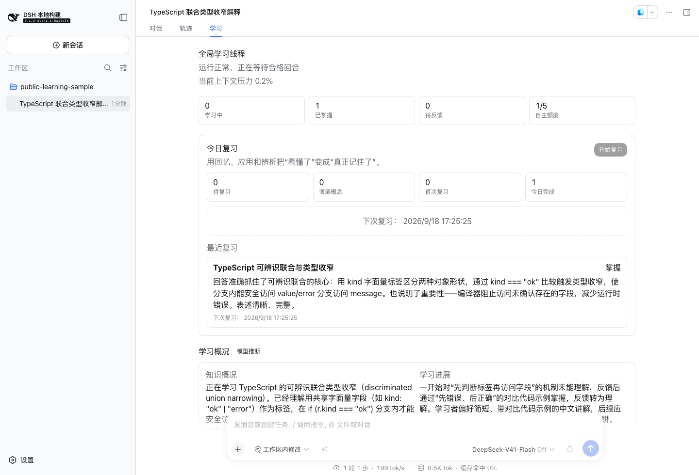
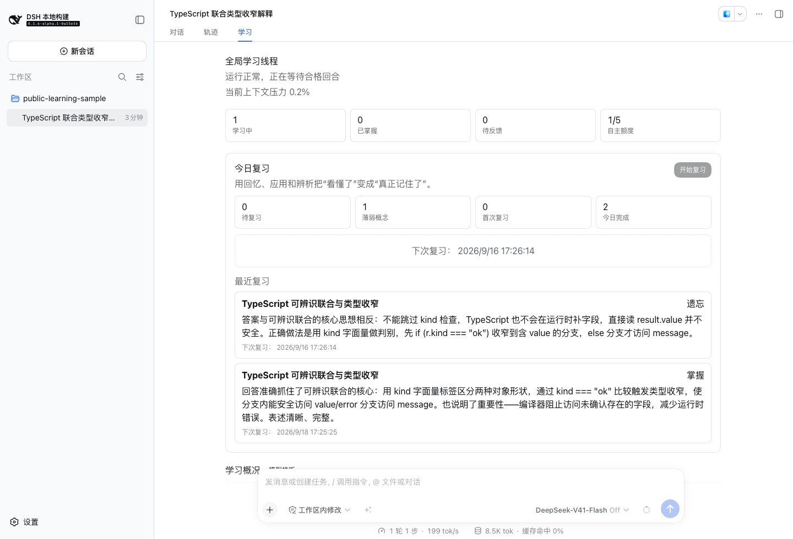
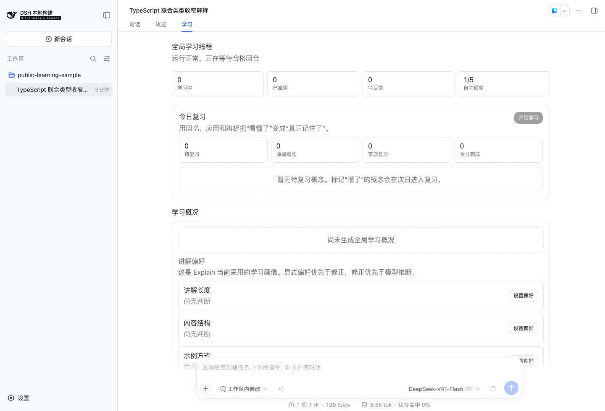

# v0.3.0 真实模型验收

2026-09-15，在真实组装 DSH Web 中完成一次公开 TypeScript 样例的学习闭环。主回答、自动讲解、重讲、上下文压缩、主动讲解和复习评估均使用真实官方模型响应。结果与截图的 SHA-256 见 [result.json](./assets/real-model-20260915/result.json)。

## 精确环境

| 项目 | 本次取值 |
|---|---|
| Explain | `0.3.0`，运行时代码 `de416e535ced1ee7e786effec9328986aefc0f90`（PR #40 合入提交） |
| DSH | `0.1.6-alpha.1`，源码 `0a15e36e7f82b6ed45af6fa9759f29b40dcd965d` |
| 模型 | 主 Agent 与辅助模型均为 `deepseek-official/deepseek-flash` |
| 协议 | 官方 `messages`，`thinking: disabled`；未设置自定义 API 地址 |
| 模型目录 | 官方 `/models` 返回 HTTP 200，确认该账号可用的精确模型 ID |
| 隔离 | 全新测试 home、profile、浏览器和仅含公开样例的工作区；不读取日常会话 |
| 自主额度 | 每 24 小时 5 次，本次使用 1 次 |
| 验收配置 | `idleCompactMs: 10000`、`timeoutMs: 60000`、辅助输出上限 1600 tokens、`maxAttempts: 1` |
| 数据格式 | SQLite schema 4，backup v3 |

凭据只从已有本地配置注入测试进程，不进入截图、公开证据或仓库。日常模型设置未修改。发布收尾提交只补充文档和证据；运行时代码与上面的已合入提交相同。每个发布提交的门禁仍以其自己的 [CI](https://github.com/yuezengwu/dsh-explain/actions/workflows/ci.yml) 为准。

## 实际操作与结果

1. **生成真实来源与自动讲解。** 从空白会话发送下方输入，获得一轮主模型回答；Explain 自动提取 `typescript-discriminated-union-narrowing`，解释判别字段、分支收窄和未判断就访问属性的错误，来源绑定到回合 1。自主额度为 1/5。见[讲解与推断](./assets/real-model-20260915/01-real-explanation.txt)。
2. **请求重讲并修正偏好。** 点击「没懂」，模型生成第二版讲解。把“示例方式”修正为“使用两个对比代码示例，先展示错误，再展示正确写法。”，界面显示“用户修正”；后续真实空闲压缩后仍保留。见[重讲与修正](./assets/real-model-20260915/02-rephrase-and-profile.txt)。
3. **理解后进入复习。** 点击「懂了」，核验真实排期在次日。为立即验收，在隔离数据库中仅把 `review_state.next_review_at` 改为过去，刷新后从界面开始回忆题。下方正确转述被真实辅助模型评为 `mastered`，stage 进入 1，下次安排为评估后恰好 3 天。见[正确复习](./assets/real-model-20260915/03-correct-review.txt)。
4. **验证错误答案。** 确认上一步三天排期后，再次仅提前隔离数据库的到期时间。从界面开始应用题，提交下方故意错误的答案，被评为 `forgotten`。反馈明确指出 TypeScript 不在运行时补字段，界面恢复为学习中和薄弱概念，下次为评估后恰好 1 天。见[错误复习](./assets/real-model-20260915/04-wrong-review.txt)。
5. **学习精确回答。** 对话页点击「学习这个回答」，只产生 `/explain --answer 1 …` 草稿。保留回合坐标，把请求改为解释编译期检查与运行时字段的区别并提交；辅助模型生成对应讲解，来源仍是回合 1，自主额度仍为 1/5。见[回答命令结果](./assets/real-model-20260915/05-real-answer-command.txt)。
6. **导出与清空。** 设置页下载 `dsh-explain-backup-v3.json`：5 条 entries（3 次讲解、2 次反馈）、2 次复习、有效用户修正及审计均存在；检查不含私有 `sourceSummary`、使用的 API key 或测试工作区绝对路径。输入 `CLEAR` 后通过界面删除数据，学习数据表计数归零；启用、模型路由、额度设置和已用 1 次的计数不变。见[清空设置](./assets/real-model-20260915/07-clear-settings.txt)、[清空学习视图](./assets/real-model-20260915/08-cleared-learning.txt)及 [result.json](./assets/real-model-20260915/result.json) 的前后计数。

宿主退出后用官方持久化只读接口复核：主会话仍只有 1 个 `turn/start`、1 个 `assistant/message`，手动学习请求保留标准 command 生命周期。浏览器未捕获未处理页面错误。此检查不把主会话日志声称为完全不变：命令生命周期本来就应写入宿主事件。

### 公开输入

主会话请求：

> 我正在学习 TypeScript，请用中文简短解释：type Result = { kind: "ok"; value: number } | { kind: "error"; message: string }。为什么判断 result.kind === "ok" 后就能安全访问 value？我更容易理解具体代码例子，请给一个很短的例子和一个常见错误。不要调用工具，也不需要读取任何文件。

正确回忆答案：

> Result 是两种对象形状中的一种。kind 保存不同的字面量标签，判断 kind === "ok" 会排除 error 那种形状，因此当前分支的 result 一定带有 number 类型的 value。else 分支才能访问 message。它让编译器阻止在尚未确认形状时访问可能不存在的字段，减少运行时错误。

故意错误的应用答案：

> 不用检查 kind，所有 Result 对象都有 value 和 message。TypeScript 会在运行时自动补出缺少的字段，所以直接读取 result.value 始终安全。

精确回答学习请求：

```text
/explain --answer 1 请解释这个回答中 TypeScript 的类型检查只发生在编译期，而不会在运行时自动补齐属性这一点。
```

## 界面证据

正确转述被判为掌握，三天后复习：



错误答案被指出具体误解，概念恢复学习中：



清空学习内容后，自主额度仍为 1/5：



## 复现与范围

按[兼容文档](./COMPATIBILITY.md#本地复现)构建精确 DSH 与 Explain 提交，并在独立 `DSH_HOME` 启动 Web。使用自己已有的官方凭据，在学习设置中选择实际可用模型，按上述公开输入完成操作。复习可等待真实排期；如要加速，只允许修改专用测试库的到期字段，并先记录原排期。不要在日常学习库执行该操作。

本次不是无人干预的时间流逝实验：两次到期时间由验收驱动提前，空闲压缩阈值也缩短至 10 秒；模型响应没有预置或重放。该样例证明当前路由的功能闭环和正反答案评估，不证明长期记忆改善、全部题型或所有模型与宿主组合的教学质量。八宿主的无密钥自动化矩阵另见[验收矩阵](./ACCEPTANCE.md)。

学习概况是模型推断；本次概况叙述仍可能滞后于最近的错误答案，界面的结构化掌握状态和复习记录以数据库为准。重讲中的代码围栏目前按正文显示。两项表现作为后续教学体验改进的输入记录，不改变本次已经验证的状态、排期和数据治理结果。
